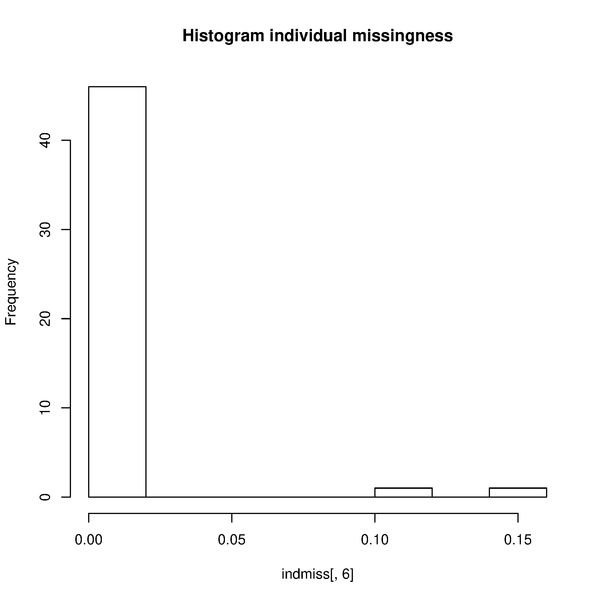
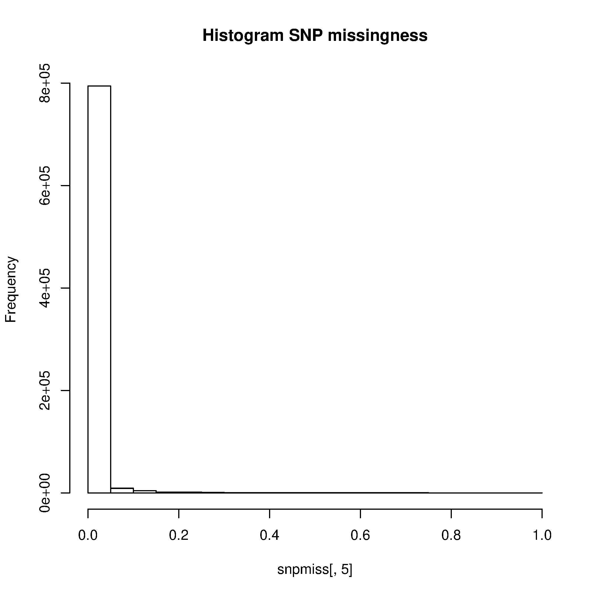
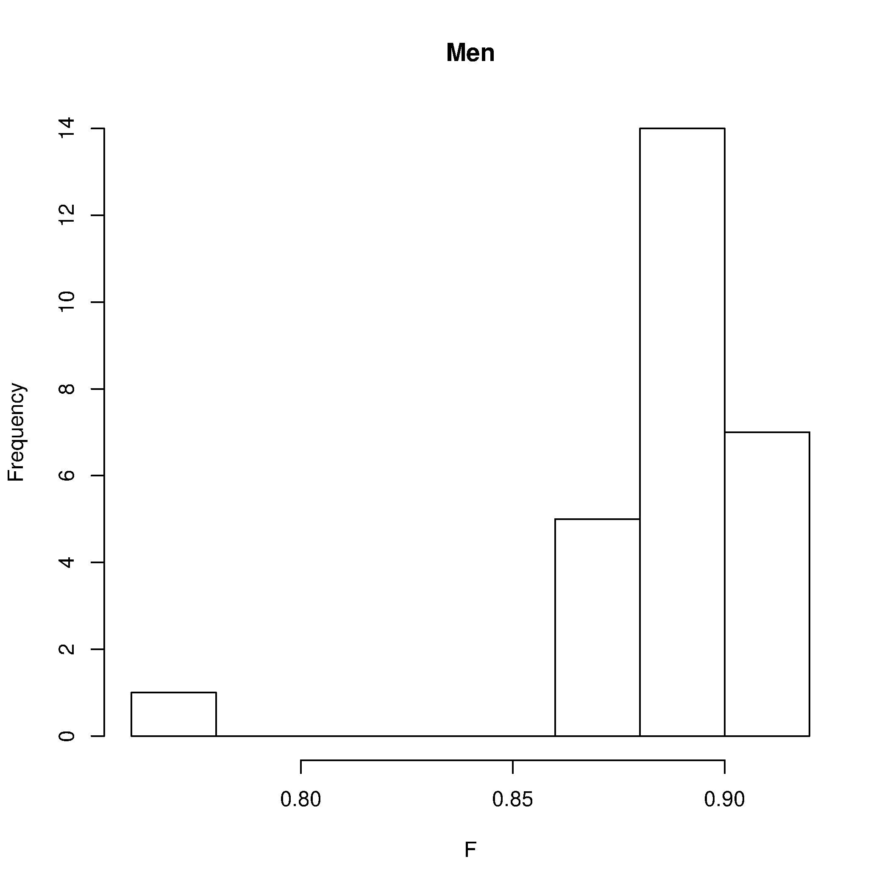
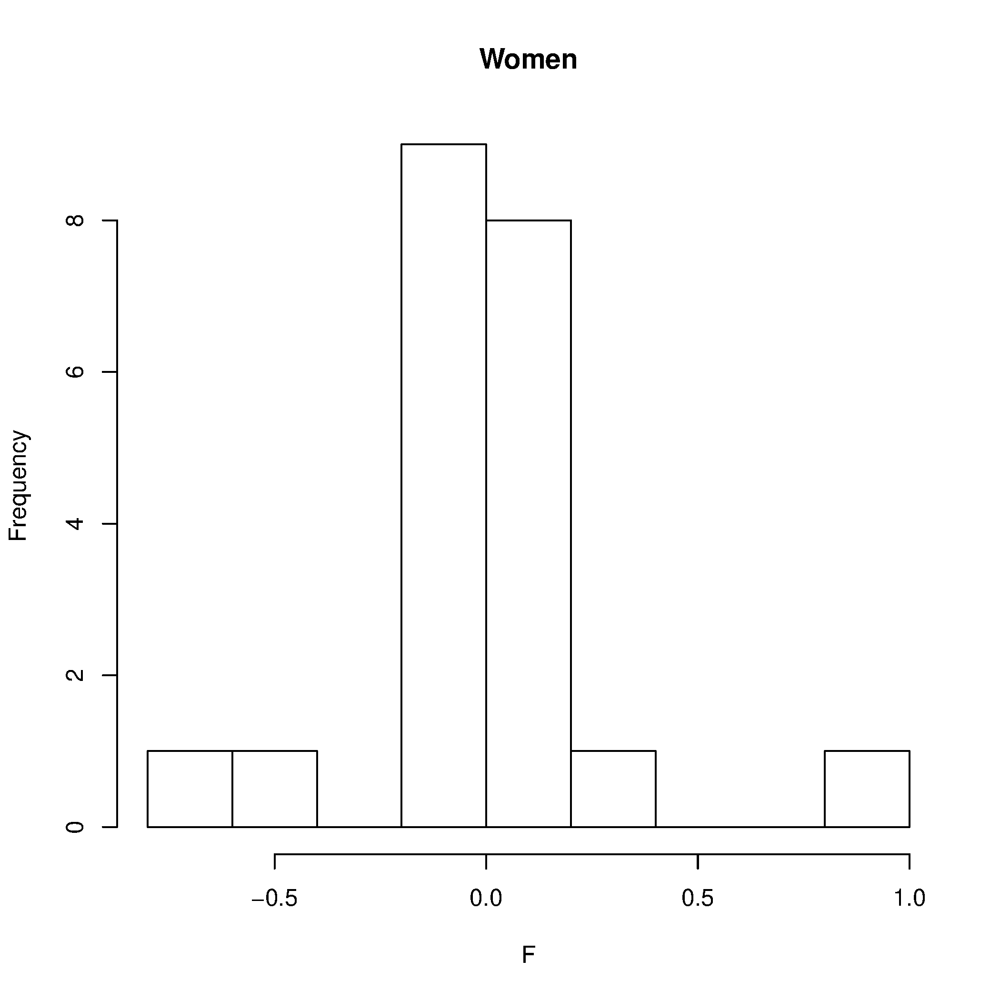
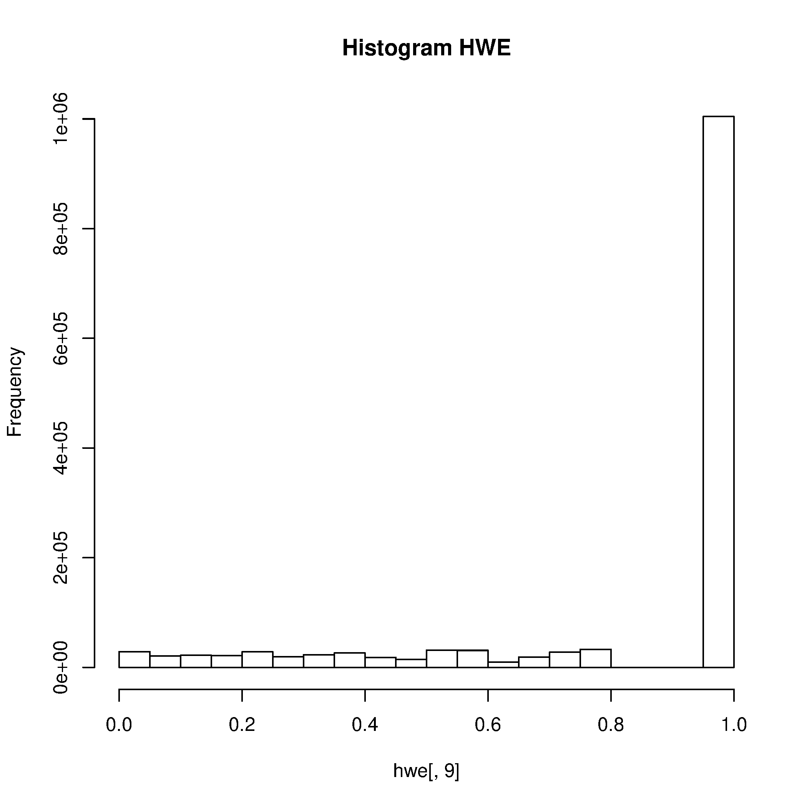
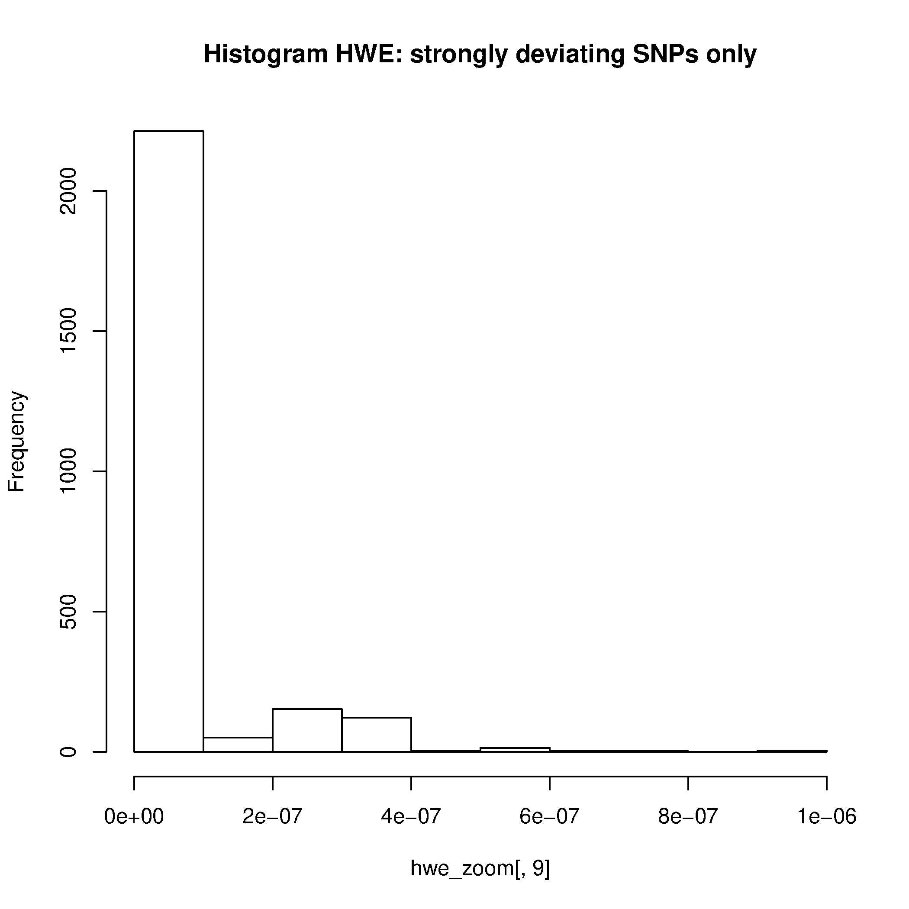
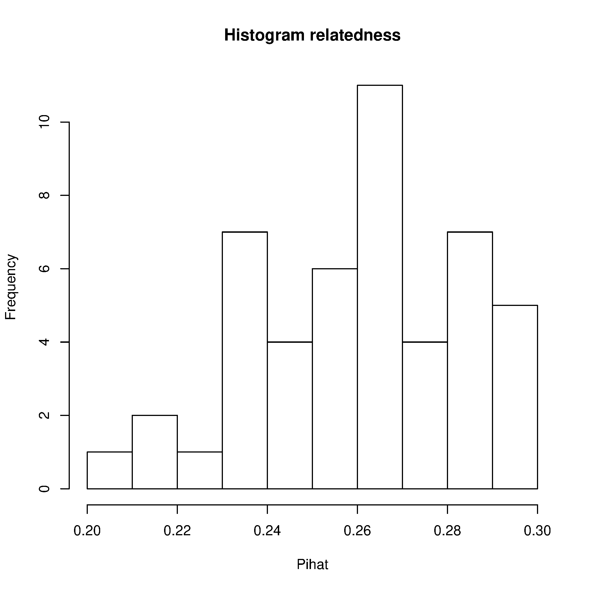
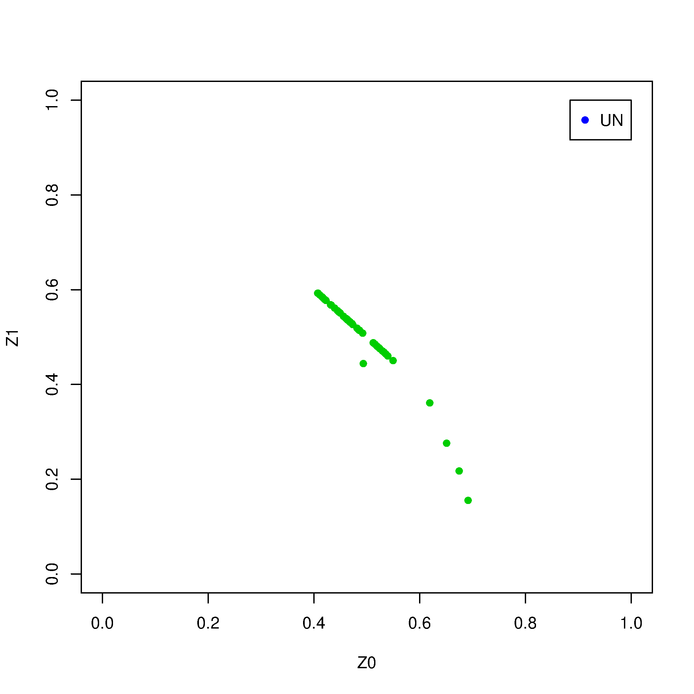
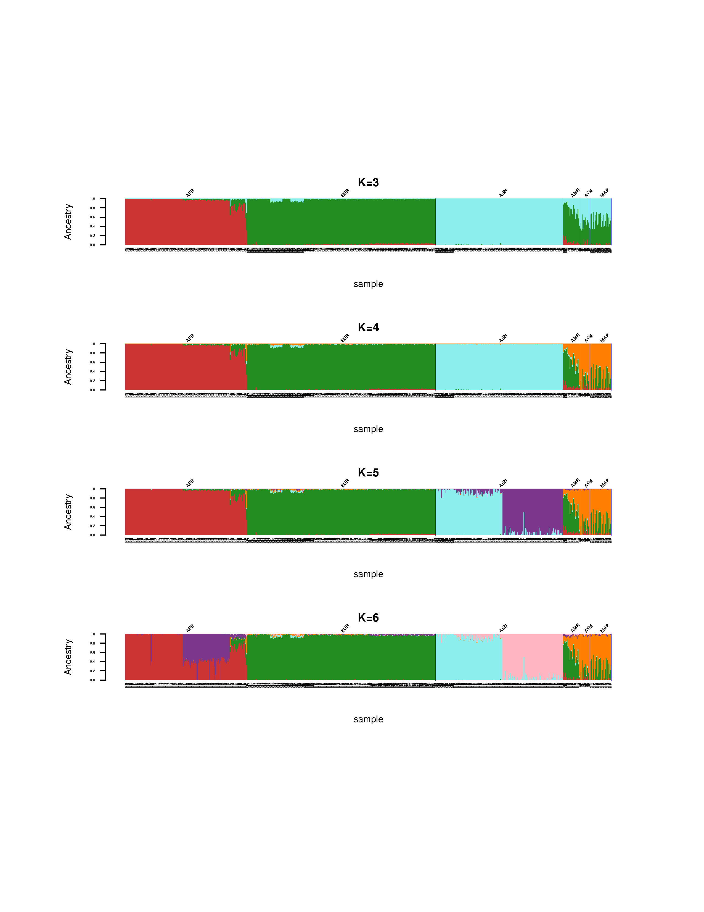

# Análisis genético de poblaciones

## Tabla de contenidos

* [Tabla de contenidos](#tabla-de-contenidos)
  * [Acerca de este tutorial](#acerca-de-este-tutorial)
  * [Descripción de los datos](#descripción-de-los-datos)
  * [Ubicación de los datos](#ubicación-de-los-datos)
  * [Generar un directorio de trabajo](#generar-un-directorio-de-trabajo)
    * [Parte 1: Análisis de control de calidad](#parte-1-análisis-de-control-de-calidad)
  * [Paso 1](#paso-1)
    * [Tarea:](#tarea)
  * [Paso 2](#paso-2)
    * [Tarea:](#tarea-1)
  * [Paso 3: Filtrado de SNPs](#paso-3-filtrado-de-snps)
    * [Tarea](#tarea-2)
  * [Paso 4: Borrar SNPs por filtro de HWE](#paso-4-borrar-snps-por-filtro-de-hwe)
    * [Tarea](#tarea-3)
  * [Paso 5: Eliminar parentescos desconocidos](#paso-5-eliminar-parentescos-desconocidos)
    * [Tarea](#tarea-4)
      * [Parte 2: Unir datos locales con 1000G](#parte-2-unir-datos-locales-con-1000g)
  * [Paso 1: Merge de los datos ChileGenomico con 1000G](#paso-1-merge-de-los-datos-chilegenomico-con-1000g)
  * [Paso 2: Homologar la versión del genoma](#paso-2-homologar-la-versión-del-genoma)
  * [Paso 3: Fusionar los conjuntos de datos HapMap y 1000 Genomes](#paso-3-fusionar-los-conjuntos-de-datos-hapmap-y-1000-genomes)
  * [Paso 4:  Intercambiar alelos de SNPs con potenciales problemas de hebra](#paso-4--intercambiar-alelos-de-snps-con-potenciales-problemas-de-hebra)
  * [Paso 5: Combinar 1000G con ChileGenomico.](#paso-5-combinar-1000g-con-chilegenomico)
    * [Parte 3: Análisis de estructura poblacional](#parte-3-análisis-de-estructura-poblacional)
  * [Paso 1: Realizar MDS en datos HapMap-ChileGenomico](#paso-1-realizar-mds-en-datos-hapmap-chilegenomico)
  * [Paso 2: Generar un archivo con información de poblaciones](#paso-2-generar-un-archivo-con-información-de-poblaciones)
  * [Paso 3: Graficar resultados de MDS](#paso-3-graficar-resultados-de-mds)
    * [Tarea:](#tarea-5)
  * [Paso 4: Realizar un análisis de ancestría](#paso-4-realizar-un-análisis-de-ancestría)
    * [Tarea:](#tarea-6)
  * [Paso 5: Genere gráficos de sus resultados](#paso-5-genere-gráficos-de-sus-resultados)

### Acerca de este tutorial

El  objetivo del tutorial es introducir técnicas de el análisis de datos de genotipificación a nivel genómico para detectar **estructura población**. Se presenta un flujo de trabajo de análisis completo utilizando el comandos en UNIX y lenguaje R.  La primera parte de este tutorial se base en el [tutorial de GWA](https://github.com/MareesAT/GWA_tutorial/) desarrollado independientemente por Andries Marees. Para más detalles ver el paper que acompaña a dicho tutorial [GWA tutorial paper](https://www.ncbi.nlm.nih.gov/pubmed/29484742). Aunque se utilizan varios paquetes de R durante el tutorial, no se puede cubrir toda la funcionalidad disponible en cada uno de ellos.  Consulte la documentación de cada software y paquete para obtener más detalles sobre su funcionalidad. El contenido de este tutorial es responsabilidad exclusiva del autor y no ha sido respaldado por los autores de los softwares ni paquetes de R aquí utilizados. 

### Descripción de los datos

Este tutorial utilizará datos públicos de genotipificación generados con microarreglos en los proyectos [HapMap](https://www.genome.gov/acerca-del-proyecto-internacional-hapmap) y [ChileGenomico](http://chilegenomico.med.uchile.cl/). Los datos en el tutorial de GWA y fueron obtenidos originalmente del [sitio de NCBI](ftp://ftp.ncbi.nlm.nih.gov/hapmap/genotypes/2010-05_phaseIII/plink_format/).

### Ubicación de los datos

Se utilizarán los datos del proyecto 1000G incluidos en el tutorial **GWA_tutorial** obtenido de [este repositorio en GitHub](https://github.com/MareesAT/GWA_tutorial/). Puede encontrar el tutorial completo y los datos en el siguiente directorio:

```
/datos/compartido/GWA_tutorial/
```

Genere una variable de ambiente $G para almacenar la ruta a los datos de 1000G. Esto servirá para acortar los siguientes comandos.

```sh
$ export T=/datos/compartido/GWA_tutorial/1_QC_GWAS
$ export P=/datos/compartido/GWA_tutorial/2_Population_stratification/
```

**nota 1:** el símbolo ~ es un atajo para el directorio de origen del usuario (home). En este caso, `/shared/bioinfo1`.
**nota 2:** es importante que no existan espacios al rededor del símbolo igual. Si la tuviera espacios, hay que usar comillas dobles.

Los datos de ChileGenomico están ubicados en 

```
 /datos/compartido/ChileGenomico/
```

Genere una variable de ambiente para que sea más fácil acceder sus archivos.

```sh
$ export C=/datos/compartido/ChileGenomico
```

Los datos de 1000G están ubicados en 

```
~/1000G/
```

Genere una variable de ambiente para que sea más fácil acceder sus archivos.

```sh
$ export G=~/1000G
```

Los scripts generados específicamente pare este tutorial se encuentran en 

```sh
~/WK2019-PopGeno
```

Genere una variable de ambiente

```sh
$ export W=~/WK2019-PopGeno
```

### Generar un directorio de trabajo

Genere un directorio para realizar su trabajo usando la inicial de su nombre y su apellido:

```sh
$ mkdir pguallardo
$ cd pguallardo
```

Genere un directorio dentro de este, para la realización de este tutorial:

```sh
$ mkdir -p Unidad2/Sesion2
$ cd Unidad2/Sesion2
```

### Cargar el software

Para correr programas que no vienen con el sistema, primero debe cargar el módulo respectivo. En este tutorila usariemos Plink v1.9 y R v4.0.5

```sh
$ module load plink/1.90
$ module load R/4.0.5
```

## Parte 1: Análisis de control de calidad

### Paso 1

Investigar la cantidad de genotipos perdidos los datos de 1000G.

```sh
$ plink --bfile $C/chilean_all48_hg19 --missing
```

Este paso generó los siguientes archivos: plink.imiss y plink.lmiss, que muestras la proporción de datos perdidos para cada SNP y para cada y individuo, respectivamente.

Genere gráficos para visualizar los resultados

```sh
$ Rscript --no-save $T/hist_miss.R
```

Elimine los SNPs e individuos con alto nivel de datos perdidos (>0.02). Se puede encontrar la explicación para este paso y subsecuentes de control de calidad en el box 1 del paper citado y con los comentarios del tutorial asociado.





Elimine SNPs e individuos con pérdida de datos >0,2

```sh
plink --bfile $C/chilean_all48_hg19 --geno 0.2 --make-bed --out chilean_all48_hg19_2
plink --bfile chilean_all48_hg19_2 --mind 0.2 --make-bed --out chilean_all48_hg19_3
```

Elimine SNPs e individuos con pérdida de datos >0,02

```sh
plink --bfile chilean_all48_hg19_3 --geno 0.02 --make-bed --out chilean_all48_hg19_4
plink --bfile chilean_all48_hg19_4 --mind 0.02 --make-bed --out chilean_all48_hg19_5
```

#### Tarea:

Responda las siguientes preguntas:

1. ¿Cómo se llaman los archivos que contienen las tasas de datos perdidos por SNP y por muestra?
2. ¿Cuántas variantes se eliminaron por tener una tasa de datos perdidos mayor a 0.2?
3. ¿Cuántos individuos tenían una tasa de datos perdidos mayor a 0.02?
4. Basados en los histogramas y en sus cálculos, ¿qué valores umbrales de datos perdidos para muestras y SNPs sugeriría?

### Paso 2

Revise discrepancias entre entre el sexo declarado en el la tabla de fenotipos (archivo ped/bed) y el inferido desde los genotipos.

Calcularemos es valor F, que se basa la estimación del coeficiente de consanguinidad (homocigocidad) en el cromosoma X. Los individuos de sexo femenino deberían tener un valor de F<0.2. Los de sexo masculino, >0,8. El programa PLINK etiquetará a los individuos que no cumplan con ninguna de estas dos condiciones con la palabra "PROBLEM".

```sh
$ plink --bfile chilean_all48_hg19_5 --check-sex
```

Genere gráficos para visualizar el resultados del check de sexo.

```R
$ Rscript --no-save $T/gender_check.R
```




Podemos ver que hay una mejor con una discrepancia de sexo, dado que tiene un valor de F de 0,99. Este tipo de problemas es usual cuando se analizan nuevos sets de datos, que aun no han sido curados. Generalmente están indicando un error en la identificación de muestras. Posiblemente se intercambió la muestra de un hombre con la de una mujer. Note que los cambios de muestras entre individuos del mismo sexo pasarán desapercibidos a esta prueba.

Visualize las primeras líneas del archivo generado.

```sh
$  head plink.sexcheck
      FID       IID       PEDSEX       SNPSEX       STATUS            F
  CDSJ177   CDSJ177            1            1           OK       0.9147
  CDSJ021   CDSJ021            1            1           OK       0.8743
   ARI006    ARI006            1            1           OK       0.8936
   ARI021    ARI021            1            1           OK        0.885
   ARI022    ARI022            2            1      PROBLEM       0.9051
  CDSJ174   CDSJ174            1            1           OK       0.8754
  CDSJ175   CDSJ175            1            1           OK       0.8939
  CDSJ046   CDSJ046            1            1           OK       0.8902
  CDSJ176   CDSJ176            1            0      PROBLEM       0.7645
```

Genere una lista con los individuos con discrepancia de sexo. Este debe tener dos columnas, con el ID de familia y de individuo respectivamente.

```sh
$ grep "PROBLEM" plink.sexcheck | awk '{print$1,$2}'> sex_discrepancy.txt
```

Elimine los individuos con discrepancias

```sh
$ plink --bfile chilean_all48_hg19_5 --remove sex_discrepancy.txt --make-bed --out chilean_all48_hg19_6 
```

#### Tarea:

1. ¿Cuántos individuos fueron eliminados por discrepancia de sexo?
2. ¿Qué riesgo(s) se corre(n) si no se eliminaran?

### Paso 3: Filtrado de SNPs

Genere un archivo con SNPs autosomales solamente.

```sh
$ awk '{ if ($1 >= 1 && $1 <= 22) print $2 }' chilean_all48_hg19_6.bim > snp_1_22.txt
$ plink --bfile chilean_all48_hg19_6 --extract snp_1_22.txt --make-bed --out chilean_all48_hg19_7
```

Calcule las frecuencias alélicas para cada SNP.

```sh
$ plink --bfile chilean_all48_hg19_7 --freq --out MAF_check
```

Revise las primeras filas del archivo generado.

```sh
head MAF_check.frq
 CHR                        SNP   A1   A2          MAF  NCHROBS
   1                  rs4951929    C    T      0.08889       90
   1                 rs12562034    A    G       0.1667       90
   1                  rs2980300    T    C       0.2111       90
   1                 rs61768207    A    G      0.05556       90
   1                  rs2518996    G    A       0.4556       90
   1                 rs57181708    G    A       0.1667       90
   1                  rs4422949    G    A       0.2222       90
   1                 rs11516185    G    A       0.4889       90
   1                 rs11507767    G    A       0.1333       90
```

Genere a gráfico de la distribución de frecuencia del alelo menor (MAF por su sigla en inglés Mino Allele Frequency).

```sh
$ Rscript --no-save $T/MAF_check.R
```

Elimine los SNPs monomórficos (sin variabilidad). En el set hay, en este punto, 45 individuos, por lo tanto, la menor frecuencia alélica posible para un polimorfismo es 1/(2x45)=0,011. Utilizaremos este valor como mínima MAF.
*** Nota: *** En el tutorial de GWAS además se borran los SNPs con frecuencia alélica menor a 0,05. Sin embargo eso no es necesario para estudios de estructura.

```sh
plink --bfile chilean_all48_hg19_7 --maf 0.011 --make-bed --out chilean_all48_hg19_8
...
Calculating allele frequencies... done.
98544 variants removed due to minor allele threshold(s)
(--maf/--max-maf/--mac/--max-mac).
459378 variants and 45 people pass filters and QC.
...
done.
```

Como ve, se eliminaron 98.544 SNPs por el filtro de frecuencia alélica.

#### Tarea

1. ¿Cuál es el nombre del primer conjunto de datos que solo contiene SNPs en autosomas?
2. ¿Cuántos SNPs se encontraban en cromosomas sexuales?
3. ¿Como calcularía el número de cromosomas que porta cada uno de los alelos para cada SNP?

### Paso 4: Borrar SNPs por filtro de HWE

Los SNPs cuyos genotipos tengan frecuencias que se desvíen demasiado desde los valores esperados en Equilibrio de Hardy-Weinberg (HWE) pueden tener errores de genotipificación y deben ser eliminados.

Revise la distribución de valores de p para el test HWE.

```sh
plink --bfile chilean_all48_hg19_8 --hardy
```

vamos a seleccionar SNPs con valores p < 0.000001, lo cual es requerido por unos de los dos siguientes scripts de R. Esto nos permitirá visualizar los SNPs con grandes de desvíos desde HWE.

```sh
awk '{ if ($9 <0.000001) print $0 }' plink.hwe > plinkzoomhwe.hwe
Rscript --no-save $T/hwe.R
```





Filtre los SNPs que no cumplen con el filtro MAX>0,000001.

```sh
plink --bfile chilean_all48_hg19_8 --hwe 1e-6 --hwe-all --make-bed --out chilean_all48_hg19_9
```

*** Nota:*** en el tutorial de GWA se eliminan individuos con heterocigocidad mayor o menor a 3 desviaciones estándar desde el promedio, dado que sugieren mezcla de muestras o consanguinidad. No está claro que este criterio sea válido poblaciones mestizas. Aquí saltaremos ese filtro, principalmente para ahorrar tiempo.

#### Tarea

1. ¿Cuál es el nombre del archivo con los resultados de la prueba de HWE?
2. ¿Basándose en la distribución de los valores de *p*, le parece el umbral usado razonable o propondría otro valor?

### Paso 5: Eliminar parentescos desconocidos

Es muy importante revisar si existen parentesco desconocidos en el set de datos, porque pueden sesgar las estimaciones de ancestría (y de asociación con fenotipos).

Las pruebas de parentesco asumen que los SNP no están correlacionados, vale decir que no tienen un fuerte ligamiento. Para generar una lista de SNPs sin correlaciones muy altas, exploremos regiones de inversión (inversion.txt [regiones con alto LD]) y eliminaremos SNPs con el argumento  `command --indep-pairwise`.

Los parámetros `50 5 0.2` indican: tamaño de ventana en número de SNPs, el paso de desplazamiento de la ventana en número de SNPs, y el máximo coeficiente de correlación múltiple (r2) de un SNP respecto de todos los otros SNPs en la ventana.

```sh
plink --bfile chilean_all48_hg19_9 --exclude $T/inversion.txt --range --indep-pairwise 50 5 0.2 --out indepSNP
```

Asumiendo una muestra poblacional aleatoria, vamos a excluir todos los individuos que tengan un valor pihat ≥ 0,2.

```sh
plink --bfile chilean_all48_hg19_9 --extract indepSNP.prune.in --genome --min 0.2 --out pihat_min0.2
```

Visualice las primeras líneas del resultado.

```sh
$ head pihat_min0.2.genome | cut -c 1-77
     FID1     IID1     FID2     IID2 RT    EZ      Z0      Z1      Z2  PI_HAT
  CDSJ177  CDSJ177   ARI001   ARI001 UN    NA  0.4733  0.5267  0.0000  0.2634
  CDSJ021  CDSJ021   ARI001   ARI001 UN    NA  0.5359  0.4641  0.0000  0.2320
   ARI006   ARI006   ARI001   ARI001 UN    NA  0.4314  0.5686  0.0000  0.2843
   ARI021   ARI021   ARI018   ARI018 UN    NA  0.6915  0.1554  0.1530  0.2307
   ARI021   ARI021   ARI015   ARI015 UN    NA  0.6506  0.2759  0.0736  0.2115
   ARI021   ARI021   ARI001   ARI001 UN    NA  0.4205  0.5795  0.0000  0.2897
   ARI021   ARI021   ARI019   ARI019 UN    NA  0.6748  0.2174  0.1078  0.2165
  CDSJ174  CDSJ174   ARI001   ARI001 UN    NA  0.5196  0.4804  0.0000  0.2402
  CDSJ175  CDSJ175   ARI001   ARI001 UN    NA  0.4559  0.5441  0.0000  0.2720
$ head pihat_min0.2.genome | cut -c 78-
 PHE       DST     PPC   RATIO
  -1  0.788650  1.0000  3.6279
  -1  0.773401  1.0000  3.5860
  -1  0.787614  1.0000  4.2789
  -1  0.848091  1.0000  2.6656
  -1  0.841702  1.0000  3.1995
  -1  0.792681  1.0000  4.1797
  -1  0.843969  1.0000  2.8519
  -1  0.772496  1.0000  3.4360
  -1  0.788864  1.0000  3.8086
```

Genere gráficos para evaluar estos parentesco con el siguientes script en R.

```sh
Rscript --no-save $T/Relatedness.R
```



 Explicación: PO = parent-offspring, UN = unrelated individuals.

Usemos R para investigar cuáles son los individuos que están generando más problemas.

```
$ R
> rel <- read.table("pihat_min0.2.genome", header=T)
> table(rel$IID1)

 ARI001  ARI002  ARI003  ARI004  ARI006  ARI008  ARI013  ARI015  ARI017  ARI018  ARI021 
     11       1       1       1       1       1       1       1       1       2       4 
 ARI023 CDSJ020 CDSJ021 CDSJ046 CDSJ099 CDSJ122 CDSJ157 CDSJ174 CDSJ175 CDSJ177 CDSJ262 
      1       1       1       1       1       1       1       1       1       1       1 
CDSJ283 CDSJ284 CDSJ297 CDSJ299 CDSJ347 CDSJ361 CDSJ372 CDSJ400 CDSJ403 CDSJ469 CDSJ471 
      1       1       1       1       1       1       1       1       1       1       1 
CDSJ472 
      1 
> table(rel$IID2)

 ARI001  ARI008  ARI014  ARI015  ARI018  ARI019 CDSJ032 CDSJ048 CDSJ106 CDSJ108 CDSJ167 
     32       1       2       1       1       3       1       1       1       1       1 
CDSJ321 CDSJ344 CDSJ417 
      1       1       1 
```

 Claramente el individuo ARI001 genera la mayoría de los aparentes parentescos. Revisemos qué parentescos quedan si eliminamos este individuo.

```R
> subset(rel, !IID1 %in% "ARI001" & !IID2 %in% "ARI001")
     FID1   IID1   FID2   IID2 RT EZ     Z0     Z1     Z2 PI_HAT PHE      DST PPC
4  ARI021 ARI021 ARI018 ARI018 UN NA 0.6915 0.1554 0.1530 0.2307  -1 0.848091   1
5  ARI021 ARI021 ARI015 ARI015 UN NA 0.6506 0.2759 0.0736 0.2115  -1 0.841702   1
7  ARI021 ARI021 ARI019 ARI019 UN NA 0.6748 0.2174 0.1078 0.2165  -1 0.843969   1
16 ARI018 ARI018 ARI014 ARI014 UN NA 0.4936 0.4438 0.0626 0.2845  -1 0.852064   1
48 ARI008 ARI008 ARI019 ARI019 UN NA 0.6189 0.3611 0.0200 0.2005  -1 0.837686   1
    RATIO
4  2.6656
5  3.1995
7  2.8519
16 4.0182
48 3.3516
```

El individuo ARI021 y el ARI018 también son candidatos a ser eliminados. Sin bien ARI008 y ARI019 tienen un coeficiente de parentesco de 0.2005, está muy cerca del límite que queremos aceptar así que los dejaremos. Además, hay que considerar que los coeficientes de parentesco pueden estar sobre estimados en individuos mestizos. El software [REAP](https://www.ncbi.nlm.nih.gov/pubmed/22748210) puede dar cuenta de esto y generar mejores estimaciones.

Cree un archivo con el ID de familia y de individuo para ser eliminado usando el editor de texto `vi`.

```sh
$ awk '$2=="ARI001" || $2=="ARI021" || $2=="ARI018"' chilean_all48_hg19_9.fam > to_romeve_by_relatedness.txt
```

Borre los individuos (en este caso solo uno) con la menor tasa de genotipificación por cada par con pihat > 0,2 .

```sh
$ plink -bfile chilean_all48_hg19_9 -remove to_romeve_by_relatedness.txt -make-bed --out chilean_all48_hg19_10
```

#### Tarea

1. ¿Cuántos SNPs en aparente equilibrio de ligamiento se encontraron?
2. ¿Cuántos SNPs se eliminaron por estar en regiones de inversiones conocidas?
3. ¿Cuántos individuos quedaron luego del filtro de parentesco?
4. ¿Cuál fue el mayor coeficiente de parentesco efectivamente aceptado?

## Parte 2: Unir datos locales con 1000G

Para esta parte del tutorial, necesitará los archivo filtrados generados anteriormente:
chilean_all48_hg19_10.fam, chilean_all48_hg19_10.bim, chilean_all48_hg19_10.bed, y el archivo de SNPs con bajo LD: indepSNP.prune.in.

Adicionalmente usaremos datos obtenidos del proyecto 1000G. El preprocesamiento de los datos y control de calidad ya fueron realizados, siguiendo los pasos previamente descritos. Los datos y el script de comandos usados se encuentran en ``.

### Paso 1: Merge de los datos ChileGenomico con 1000G

Elimine variantes duplicadas del set ChileGenomico

```sh
$ plink --bfile chilean_all48_hg19_10 --list-duplicate-vars suppress-first
$ plink --bfile chilean_all48_hg19_10 --exclude plink.dupvar --make-bed --out chilean_all48_hg19_11
```

```sh
$ plink --bfile chilean_all48_hg19_10 --list-duplicate-vars suppress-first
$ plink --bfile chilean_all48_hg19_10 --exclude plink.dupvar --make-bed --out chilean_all48_hg19_11
```

Extraiga las variantes presentes en los datos de ChileGenomico.

```sh
$ cut -f 2 chilean_all48_hg19_11.bim | sort -u > chilean_all48_hg19_11.snps
```

*** Nota:*** usamos un pipe para order la lista de snps dado que es un requisito para el siguiente comando.

Extraiga las variantes presentes en los datos de 1000G.

```sh
$ cut -f 2 $G/1kG_MDS5.bim | sort -u  > 1kG_MDS5.snps
```

***Nota:*** Usamos `$G` para buscar el set `1kG_MFS5.bim` en su carpeta en vez de copiarla al directorio de trabajo. 

Encuentre la lista de SNPs en común entre ambos sets de datos.

```sh
$ comm -12 chilean_all48_hg19_11.snps 1kG_MDS5.snps > common_snps.txt
```

Extraiga los SNPs en común del set 1000G

```sh
$ plink --bfile $G/1kG_MDS5 --extract common_snps.txt --recode --make-bed --out 1kG_MDS6
```

Extraiga los SNPs en común del set ChileGenomico

```sh
$ plink --bfile chilean_all48_hg19_11 --extract common_snps.txt --make-bed --out chilean_all48_hg19_12
```

Los conjuntos de datos ahora contienen exactamente las mismas variantes.

### Paso 2: Homologar la versión del genoma

Los conjuntos de datos deben tener la misma versión de ensamble del genoma para usar las mismas coordenadas de SNPs. Para asegurarnos, cambiaremos las coordenadas en los datos de 1000 genomas usando las coordenadas de ChileGenomico.

```sh
$ awk '{print $2, $4}' chilean_all48_hg19_12.bim> buildhapmap.txt
```

buildhapmap.txt contiene un ID y una posición física por SNP en cada línea.

```
$ plink --bfile 1kG_MDS6 --update-map buildhapmap.txt --make-bed --out 1kG_MDS7
```

chilean_all48_hg19_12 y 1kG_MDS7 ahora tienen las mismas coordenadas.

### Paso 3: Fusionar los conjuntos de datos HapMap y 1000 Genomes

Antes de fusionar los datos de ChileGenomico con los datos de HapMap, queremos asegurarnos de que los archivos puedan fusionarse, para ello realizamos 3 pasos:

1) Asegurarse de que el genoma de referencia sea igual en ambos conjuntos de datos 1kG y ChileGenomico (que usen el mismo alelo A1 de referencia en el archivo bim).
2) Resolver problemas de hebra.
3) Eliminar los SNP que, después de los dos pasos anteriores, todavía difieren entre los conjuntos de datos.

Los siguientes pasos pueden ser bastante técnicos en términos de comandos, pero solo comparamos los dos conjuntos de datos y nos aseguramos de que correspondan.

1) establecer el genoma de referencia en ChileGenomico usando 1000G:

```sh
$ awk '{print $2, $5}' 1kG_MDS7.bim> 1kG_ref-list.txt
$ plink --bfile chilean_all48_hg19_12 --reference-allele 1kG_ref-list.txt --make-bed --out chilean_all48_hg19_13
```

Los conjuntos de datos 1kG y chilean_all48_hg19_13 tienen el mismo genoma (alelo) de referencia para todos los SNP.

Este comando podría generar algunas advertencias para la asignación imposible del alelo A1. Es bueno revisar:

```sh
$ grep "Impossible" chilean_all48_hg19_13.log | wc -l
0
```

En este caso no se encontraron inconsistencias. Si la hubiere, podría indicar errores de genotipificación o el uso de sondas distintas (si ambos sets provenieran de microarreglos) que quizás estén interrogando distintas hebras.

2) Resolver problemas de hebra.
   Compruebe si hay posibles problemas de filamento.

```sh
$ awk '{print $2, $5, $6}' 1kG_MDS7.bim> 1kG_MDS7_tmp
$ awk '{print $2, $5, $6}' chilean_all48_hg19_13.bim > chilean_all48_hg19_13_tmp
$ sort 1kG_MDS7_tmp chilean_all48_hg19_13_tmp | uniq -u > all_differences.txt
$ wc -l all_differences.txt
0 all_differences.txt
```

En este caso hay 0 diferencias entre los archivos. Si las hubiera, podrían deberse a problemas cambio de hebra entre conjuntos de datos.

### Paso 4:  Intercambiar alelos de SNPs con potenciales problemas de hebra

Este paso no tendrá efecto alguno sobre los datos porque no hay SNPs con problemas de hebra. Sin embargo, los incluimos en nuestro flujo de trabajo ya que pueden tener efecto en un conjunto de datos distinto.

Imprima el identificador SNP y elimine los duplicados.

```sh
$ awk '{print $ 1}' all_differences.txt | sort -u > flip_list.txt
```

Se genera un archivo de SNPs no coincidentes entre los dos archivos.

Intercambiar los alelos de los SNPs no coincidentes.

```sh
$ plink --bfile chilean_all48_hg19_13 -flip flip_list.txt --reference-allele 1kG_ref-list.txt --make-bed --out chilean_all48_hg19_14
```

Compruebe si hay SNPs que siguen siendo problemáticos después de haberlos volteado.

```sh
$ awk '{print $2, $5, $6}' chilean_all48_hg19_14.bim > chilean_all48_hg19_14_tmp
$ sort 1kG_MDS7_tmp chilean_all48_hg19_14_tmp | uniq -u> uncorresponding_SNPs.txt
$ wc -l uncorresponding_SNPs.txt
0 uncorresponding_SNPs.txt
```

Este archivo demuestra que hay 0 diferencias entre los archivos, o sea, no hay SNPs con alelos discordantes entre conjuntos de datos.

3) Eliminar SNPs problemáticos de 1kG y ChileGenomico. En este caso, este paso es innecesario ya que no quedan SNPs con problemas, pero se muestran por completitud.

```sh
$ awk '{print $ 1}' uncorresponding_SNPs.txt | sort -u > SNPs_for_exlusion.txt
```

El comando anterior genera una lista de los 0 SNP que causaron las 0 diferencias entre los conjuntos de datos 1kG y ChileGenomico después de cambiar y configurar el genoma de referencia.

Elimine los SNPs problemáticos de ambos conjuntos de datos.

```sh
$ plink --bfile 1kG_MDS7 --exclude SNPs_for_exlusion.txt --make-bed --out 1kG_MDS8
$ plink --bfile chilean_all48_hg19_14 --exclude SNPs_for_exlusion.txt --make-bed --out chilean_all48_hg19_15
```

### Paso 5: Combinar 1000G con ChileGenomico.

```sh
$ plink --bfile 1kG_MDS8 --bmerge chilean_all48_hg19_15.bed chilean_all48_hg19_15.bim chilean_all48_hg19_15.fam --allow-no-sex --make-bed --out MDS_merge
```

## Parte 3: Análisis de estructura poblacional

### Paso 1: Realizar MDS en datos HapMap-ChileGenomico

Se asume que los SNPs no están ligados. Por lo tanto usaremos un conjunto de SNPs con bajo LD

```sh
$ plink --bfile MDS_merge --extract indepSNP.prune.in --genome --out MDS_merge2
$ plink --bfile MDS_merge --read-genome MDS_merge2.genome --cluster --mds-plot 10 --out MDS_merge3
```

*** Nota***: esto no reduce el tamaño del conjunto de datos MDS_merge2, solo crea el archivo `MDS_merge2.genome` para el set reducido de SNPs con bajo LD.

### Paso 2: Generar un archivo con información de poblaciones

Descargue el archivo con información de población del conjunto de datos de 1000 genomas.

```sh
$ wget ftp://ftp.1000genomes.ebi.ac.uk/vol1/ftp/release/20100804/20100804.ALL.panel
```

El archivo 20100804.ALL.panel contiene códigos de población de los individuos de 1000 genomas.

Convierta los códigos de población en códigos de superpoblación (es decir, AFR, AMR, ASN y EUR).

```sh
awk '{print$1,$1,$2}' 20100804.ALL.panel > ethnicity_1kG.txt
sed 's/JPT/ASN/g' ethnicity_1kG.txt>ethnicity_1kG2.txt
sed 's/ASW/AFR/g' ethnicity_1kG2.txt>ethnicity_1kG3.txt
sed 's/CEU/EUR/g' ethnicity_1kG3.txt>ethnicity_1kG4.txt
sed 's/CHB/ASN/g' ethnicity_1kG4.txt>ethnicity_1kG5.txt
sed 's/CHD/ASN/g' ethnicity_1kG5.txt>ethnicity_1kG6.txt
sed 's/YRI/AFR/g' ethnicity_1kG6.txt>ethnicity_1kG7.txt
sed 's/LWK/AFR/g' ethnicity_1kG7.txt>ethnicity_1kG8.txt
sed 's/TSI/EUR/g' ethnicity_1kG8.txt>ethnicity_1kG9.txt
sed 's/MXL/AMR/g' ethnicity_1kG9.txt>ethnicity_1kG10.txt
sed 's/GBR/EUR/g' ethnicity_1kG10.txt>ethnicity_1kG11.txt
sed 's/FIN/EUR/g' ethnicity_1kG11.txt>ethnicity_1kG12.txt
sed 's/CHS/ASN/g' ethnicity_1kG12.txt>ethnicity_1kG13.txt
sed 's/PUR/AMR/g' ethnicity_1kG13.txt>ethnicity_1kG14.txt
```

Crea un archivo de etnicidad de los datos de ChileGenomico.

```sh
$ awk '{if($1~/CDSJ/) pop="MAP"}{if($1~/ARI/) pop="AYM"} {print $1, $2, pop}' chilean_all48_hg19_14.fam > ethnicityfile_CLG.txt
```

Concatenar los archivos de carrera.

```sh
$ cat ethnicity_1kG14.txt ethnicityfile_CLG.txt | sed -e '1i \ FID IID ethnicity'> ethnicityfile.txt
```

### Paso 3: Graficar resultados de MDS

```sh
$ Rscript $W/MDS_merged.R
     IID  FID.x SOL         C1          C2         C3           C4           C5
1 ARI001 ARI001   0 -0.0406769 -0.01424110 -0.0924081  0.001803800 -0.001256100
2 ARI002 ARI002   0 -0.0469810 -0.00404251 -0.0788820  0.001140350 -0.001596390
3 ARI003 ARI003   0 -0.0514636 -0.01349430 -0.0900590  0.000246449  0.000925401
4 ARI004 ARI004   0 -0.0615831 -0.02951150 -0.1095080 -0.003338710 -0.002250870
5 ARI006 ARI006   0 -0.0514338 -0.02318140 -0.1022530 -0.001913330 -0.002395160
6 ARI008 ARI008   0 -0.0521863 -0.01152950 -0.0921278  0.001553320 -0.000445462
            C6           C7           C8           C9         C10  FID.y
1  0.004404190 -0.007447020  0.014184100 -0.010402400  0.00411825 ARI001
2  0.002151910  0.001896250  0.000439761 -0.004716690  0.00383263 ARI002
3  0.000133159 -0.000325179  0.004675980 -0.004088450 -0.00150137 ARI003
4 -0.000113890  0.000147362 -0.001522850  0.000552478 -0.00157933 ARI004
5  0.001440190 -0.003645160  0.000958471 -0.003207940 -0.00300836 ARI006
6  0.001110960  0.001800130  0.001531390 -0.004898150 -0.00331712 ARI008
  ethnicity
1       AYM
2       AYM
3       AYM
4       AYM
5       AYM
6       AYM
```


#### Tarea:

1. En R, genere gráficos similares para las combinaciones Component 2 vs 3 y 3 vs 4. ¿Qué puede concluir de estos gráficos?

### Paso 4: Realizar un análisis de ancestría

Utilizaremos la herramienta [ADMIXTURE](http://software.genetics.ucla.edu/admixture/) para inferir ancestría de las muestras chilenas asumiendo un modelo simple de mezcla.

Admixture asumen que los SNPs a usar no están en LD. Tendremos que usar nuevamente nuestro archivo con SNPs en bajo LD, pero esta vez sí crearemos un set plink de datos reducidos

```sh
$ plink --bfile MDS_merge --extract indepSNP.prune.in --make-bed --out MDS_merge_r2_lt_0.2
```

1. ¿Cuántos SNPs quedaron luego del filtro?
2. ADMIXTURE asume que los individuos no están emparentados. Sin embargo, no realizamos ningún filtro. ¿Por qué?

Ahora sí podemos correr ADMIXTURE.

```sh
$ admixture -j4 --cv MDS_merge_r2_lt_0.2.bed 3 > MDS_merge_r2_lt_0.2.K3.log
```

Los argumentos usados fueron:

```
  -j4                         usar cuatro hebras de cómputo
  --cv                        realizar validación cruzada
  MDS_merge_r2_lt_0.2.bed     archivo en formad bed (plink)
  3                           número de poblaciones ancestrales (parámtro K)
  >                           redirección de la salida a un archivo
  MDS_merge_r2_lt_0.2.K3.log  archivo log con la salida del programa
```

Repitamos el procesos para valores K de 4 a 6 usando un loop.

```sh
for k in $(seq 4 6)
  do
    admixture -j44 --cv MDS_merge_r2_lt_0.2.bed $k > MDS_merge_r2_lt_0.2.K$k.log        
  done
```

#### Tarea:

1. ¿Cuántos SNPs quedaron luego del filtro?
2. ADMIXTURE asume que los individuos no están emparentados. Sin embargo, no realizamos ningún filtro. ¿Por qué?

### Paso 5: Genere gráficos de sus resultados

Primero tenemos que ordenar el archivo con la información de las muestras por públición. Esto es un requisito para el siguiente paso. Aquí elegiremos el orden en el que queremos que se muestren las poblaciones, mediante unos pocos comandos en R.

```sh
$ R --no-save
```

```R
popinfo <- read.table("ethnicityfile.txt", as.is=T, header=T)
popinfo_ls <- split(popinfo, popinfo[,3])
names(popinfo_ls)
[1] "AFR" "AMR" "ASN" "AYM" "EUR" "MAP"
popinfo_sorted <- do.call(rbind, popinfo_ls[c("AFR", "EUR", "ASN", "AMR", "AYM", "MAP")])
write.table(popinfo_sorted, "popinfo_sorted.txt", sep="\t", row.names=F)
q()
```

Utilizaremos un script en R para traficar los resultados para todos los valores de K.

```sh
Rscript $W/admixture_plot.R popinfo_sorted.txt MDS_merge_r2_lt_0.2.fam
```


