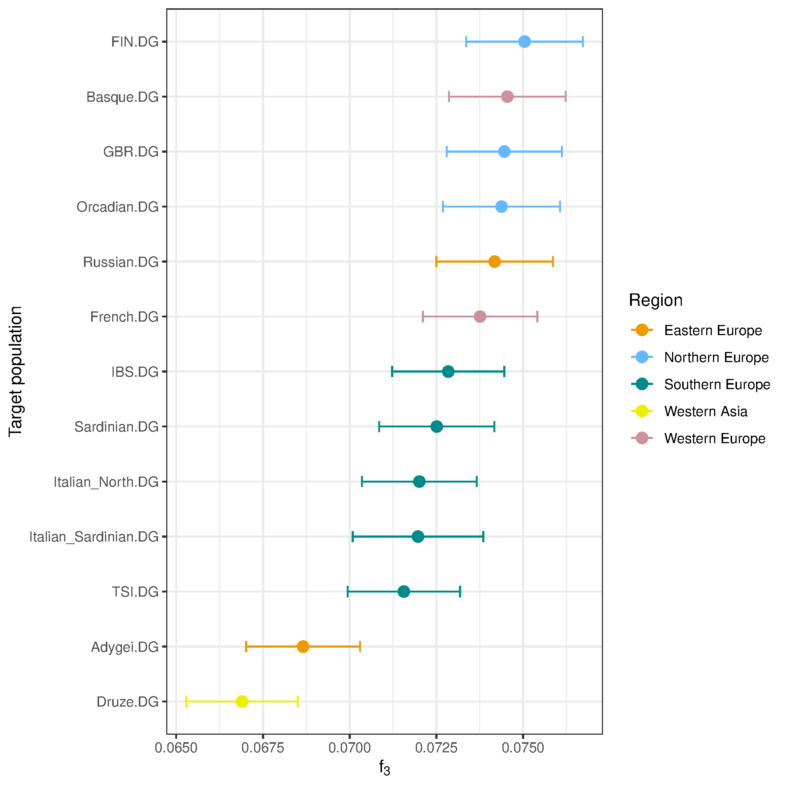

# Tutorial de Genética de Poblaciones usado estadísticos F

Autora: Constanza de la Fuente

Este tutorial se encuentra disponible en el servidor del curso (genoma.med.uchile.cl) en la siguiente ubicación.

```
~/popgen_shared/Tutorial_Actividades.R
```

Installing required packages:

```
install.packages("devtools") # if "devtools" is not installed already
devtools::install_github("uqrmaie1/admixtools")
```

If not working, install dependencies manually:

```
install.packages("Rcpp")
install.packages("tidyverse")
install.packages("igraph")
install.packages("plotly")
```

And again

```
devtools::install_github("uqrmaie1/admixtools")
```

Another option:

```
install.packages("remotes")
remotes::install_github("uqrmaie1/admixtools")
```

Once installed, load packages:

```
library(admixtools)
library(tidyverse)
library(ggplot2)
library(dplyr)
```

Set working directory

```
setwd("~/Dropbox/2025/DOCENCIA/POSTGRADO/Practico_popgen_advance/popgen_shared/")
```

Load metadata

```
metadf = read.table("~/popgen_shared/v62.0_1240k_public_metadata2.csv", header = T, sep = ",")
```

## 0.  Generate f2 blocks (transversions only and all)

Path to your genotype data in EIGENSTRAT format (without extensions)

Path prefix to genotype files

```
prefix <- "~/popgen_shared/v62.0_1240k_public"  
```

Directory to store f2 results

```
outdir <- "1000G_f2_transversions"
outdir_all <- "~/popgen_shared/aadr_1000G_f2_all"

demo_pops <- c("Altai_Neanderthal.DG", 
               "Denisova.DG", 
               "Russia_UstIshim_IUP.DG",
               "Luxembourg_Mesolithic.DG", 
               "Turkey_Marmara_Barcin_N.AG", 
               "Russia_Samara_EBA_Yamnaya.AG",
               "England_C_EBA.AG",
               "Germany_CordedWare.AG",
               "Mbuti.DG", 
               "Papuan.DG", 
               "CHB.DG", 
               "Adygei.DG",
               "Basque.DG",
               "Druze.DG",
               "French.DG",
               "Italian_North.DG", 
               "Italian_Sardinian.DG", 
               "Orcadian.DG", 
               "Russian.DG", 
               "Sardinian.DG",
               "FIN.DG", 
               "GBR.DG", 
               "IBS.DG", 
               "TSI.DG",
               "Chimp.REF",
               "MXL.DG",
               "Karitiana.DG",
               "PEL.DG",
               "Mixe.DG")

# Extract f2, but only using transversions (exclude transitions)
extract_f2(
  pref = prefix,
  outdir = outdir,
  pops = demo_pops,          # only the demo populations
  transitions = FALSE,       # exclude transitions (ancient DNA caution)
  transversions = TRUE,      # keep transversions only
  overwrite = TRUE,
  blgsize = 0.05,            # block size in Morgans (default fine)
  verbose = TRUE
)

# Extract f2, all positions
extract_f2(
  pref = prefix,
  outdir = outdir_all,
  pops = demo_pops,          # only the demo populations
  overwrite = TRUE,
  blgsize = 0.05,            # block size in Morgans (default fine)
  verbose = TRUE
)

# Load the f2 cache
f2_blocks_transv <- f2_from_precomp(outdir)

f2_blocks_all <- f2_from_precomp(outdir_all)
```

# 1. admix-f3: Detecting admixture in a target population

Expectation:

Negative f3(MXL; IBS, Karitiana): confirms admixed European × Native ancestry.

```
popA = c("MXL.DG","PEL.DG","Mixe.DG")
popB = "IBS.DG"
popC = "Karitiana.DG"
```

Run f3

```
f3res <- f3(f2_blocks_all, popA, popB, popC)
```

# 2. outgroup-f3: Shared drift between Loschbour (WHG, Luxembourg_Mesolithic) and moderns populations

Define populations

```
popA = c("Luxembourg_Mesolithic.DG")
popB = c("Adygei.DG","Basque.DG","Druze.DG","French.DG","Italian_North.DG", 
         "Italian_Sardinian.DG", "Orcadian.DG", "Russian.DG", "Sardinian.DG",
         "FIN.DG", "GBR.DG", "IBS.DG", "TSI.DG")
outg = c("Mbuti.DG")
```

Run f3

```
f3res <- f3(f2_blocks_all, outg, popA, popB)
```

Plot

```
f3res$pop3_region = metadf$region[match(f3res$pop3, metadf$popid)]

ggplot(f3res, aes(x = reorder(pop3, est), y = est, color = pop3_region)) +
  geom_point(size = 3) +
  geom_errorbar(aes(ymin = (est - se*3), ymax = (est + se*3)), width = 0.2) +
  scale_color_manual(values = c("orange2", "steelblue1", "cyan4", 
                               "yellow2", "pink3")) +
  coord_flip() +
  labs(x = "Target population",
    y = expression(f[3]),
    color = "Region") +
  theme_bw() +
  theme(plot.title = element_text(hjust = 0.5),
    legend.position = "right")
```



# 3. f4 / D-statistic — testing tree symmetry (ABBA-BABA)

If D ~ 0, pop1 and pop2 are symmetrically related to pop3 (pop4 is outgroup to all)

If D >> 0, pop1 shared more alleles with pop3 than pop2

If D << 0, pop2 shared more alleles with pop3 than pop1

```
qpdstat(f2_blocks_all, pop1="GBR.DG", pop2="TSI.DG", pop3="Mbuti.DG", pop4="Chimp.REF")
# A tibble: 1 x 8
  pop1   pop2   pop3     pop4             est        se     z      p
  <chr>  <chr>  <chr>    <chr>          <dbl>     <dbl> <dbl>  <dbl>
1 GBR.DG TSI.DG Mbuti.DG Chimp.REF -0.0000832 0.0000359 -2.32 0.0205

f4res = qpdstat(f2_blocks_all, pop1="GBR.DG", pop2=c("TSI.DG","CHB.DG","Mbuti.DG","Papuan.DG"), pop3="Altai_Neanderthal.DG", pop4="Chimp.REF")
```

Papuans may have similar Neanderthal affinity but more Denisovan affinity.

```
qpdstat(f2_blocks_all,
        pop1 = "Altai_Neanderthal.DG",
        pop2 = "Denisova.DG",
        pop3 = "Papuan.DG",
        pop4 = "GBR.DG")
# A tibble: 1 x 8
  pop1                 pop2        pop3    pop4       est      se     z        p
  <chr>                <chr>       <chr>   <chr>    <dbl>   <dbl> <dbl>    <dbl>
1 Altai_Neanderthal.DG Denisova.DG Papuan~ GBR.~ -0.00135 2.16e-4 -6.25 4.22e-10
```

## 4. qpWave / qpAdm: model an european target as mix of sources

The qpwave() function tests whether a set of Left populations can be explained as

descending from a given number of ancestral streams relative to a set of Right populations (which serve as references or outgroups).

Can the target me modeled as related to left populations?

How many independent ancestry streams are needed to explain their allele frequency relationships relative to your set of Right populations.

```
target <- "England_C_EBA.AG"  # You can replace with an ancient/modern European population
right_qpwave <- c("Mbuti.DG", "Papuan.DG", "CHB.DG", "Denisova.DG", "Russia_UstIshim_IUP.DG")

wave <- qpwave(
  f2_blocks_all,
  left = c(target, "Turkey_Marmara_Barcin_N.AG", "Luxembourg_Mesolithic.DG", "Russia_Samara_EBA_Yamnaya.AG"),
  right = right_qpwave)

wave
$f4
# A tibble: 12 x 8
   pop1             pop2          pop3  pop4        est      se       z        p
   <chr>            <chr>         <chr> <chr>     <dbl>   <dbl>   <dbl>    <dbl>
 1 England_C_EBA.AG Turkey_Marma~ Mbut~ Papu~ -0.00134  1.56e-4  -8.63  5.93e-18
 2 England_C_EBA.AG Turkey_Marma~ Mbut~ CHB.~ -0.00174  1.38e-4 -12.6   1.27e-36
 3 England_C_EBA.AG Turkey_Marma~ Mbut~ Deni~ -0.000125 1.27e-4  -0.981 3.26e- 1
 4 England_C_EBA.AG Turkey_Marma~ Mbut~ Russ~ -0.000825 1.93e-4  -4.28  1.84e- 5
 5 England_C_EBA.AG Luxembourg_M~ Mbut~ Papu~  0.00137  3.59e-4   3.81  1.41e- 4
 6 England_C_EBA.AG Luxembourg_M~ Mbut~ CHB.~  0.00108  3.21e-4   3.37  7.51e- 4
 7 England_C_EBA.AG Luxembourg_M~ Mbut~ Deni~  0.000504 2.65e-4   1.90  5.76e- 2
 8 England_C_EBA.AG Luxembourg_M~ Mbut~ Russ~  0.00208  4.38e-4   4.75  2.05e- 6
 9 England_C_EBA.AG Russia_Samar~ Mbut~ Papu~  0.000724 1.85e-4   3.92  8.87e- 5
10 England_C_EBA.AG Russia_Samar~ Mbut~ CHB.~  0.001000 1.65e-4   6.06  1.37e- 9
11 England_C_EBA.AG Russia_Samar~ Mbut~ Deni~ -0.000102 1.40e-4  -0.729 4.66e- 1
12 England_C_EBA.AG Russia_Samar~ Mbut~ Russ~  0.000427 2.05e-4   2.08  3.75e- 2

$rankdrop
# A tibble: 3 x 7
  f4rank   dof   chisq        p dofdiff chisqdiff  p_nested
   <int> <int>   <dbl>    <dbl>   <int>     <dbl>     <dbl>
1      2     2   0.811 6.67e- 1       4      19.3  6.82e- 4
2      1     6  20.1   2.63e- 3       6     232.   3.43e-47
3      0    12 252.    5.88e-47      NA      NA   NA
```

k = tested number of streams (rank + 1)

Null hypothesis (H0): “The Left populations can be explained by ≤ k ancestry streams relative to the Right populations.”

Alternative hypothesis (H1): “The Left populations require more than k ancestry streams relative to the Right populations.”

The p-value in qpWave is:

* High p-value (p > 0.05): Fail to reject H0 → the tested number of ancestry streams is sufficient.
* Low p-value (p < 0.05): Reject H0 → the tested number of ancestry streams is not sufficient; more streams are needed.
  Rank = 2: 3 ancestry streams. At least two admixture events, etc.
  Rank = 1: 2 ancestry streams. At least one admixture event between Left pops
  Rank = 0: Left pops share 1 ancestry stream relative to Right. All Left pops form a clade with respect to Right

Proportion of ancestry from source populations:

```
adm <- qpadm(
  f2_blocks_all,
  left = c(target, "Turkey_Marmara_Barcin_N.AG", 
           "Luxembourg_Mesolithic.DG", "Russia_Samara_EBA_Yamnaya.AG"),
  right = right_qpwave,
  target = target)

adm$weights
# A tibble: 3 x 5
  target           left                         weight     se     z
  <chr>            <chr>                         <dbl>  <dbl> <dbl>
1 England_C_EBA.AG Turkey_Marmara_Barcin_N.AG   0.367  0.0439 8.37
2 England_C_EBA.AG Luxembourg_Mesolithic.DG     0.0440 0.0779 0.564
3 England_C_EBA.AG Russia_Samara_EBA_Yamnaya.AG 0.589  0.0892 6.60

adm$popdrop
# A tibble: 7 x 14
  pat      wt   dof   chisq        p f4rank Turkey_Marmara_Barcin_N.AG
  <chr> <dbl> <dbl>   <dbl>    <dbl>  <dbl>                      <dbl>
1 000       0     2   0.811 6.67e- 1      2                      0.367
2 001       1     3  16.9   7.42e- 4      1                      0.406
3 010       1     3   1.17  7.60e- 1      1                      0.368
4 100       1     3  18.0   4.33e- 4      1                     NA
5 011       2     4 167.    3.67e-35      0                      1
6 101       2     4  30.1   4.76e- 6      0                     NA
7 110       2     4  39.4   5.88e- 8      0                     NA
# i 7 more variables: Luxembourg_Mesolithic.DG <dbl>,
#   Russia_Samara_EBA_Yamnaya.AG <dbl>, feasible <lgl>, best <lgl>,
#   dofdiff <dbl>, chisqdiff <dbl>, p_nested <dbl>
```

REPEAT WITH Germany_CordedWare.AG AS TARGET


# Tarea

Realice los análisis descritos en los archivos

* [project1.R](project1.R)

* [project2.R](project2.R)

* [project3.R](project3.R)

* [project4.R](project4.R)

Incluya el código más relevante y su output en formato de texto, tabla o figura, según corresponda, en un archivo markdown para cada proyecto en su repositorio.

Creen una carpeta específica para los ejercicios de esta sesión.

Identifique la tarea y el estudiante en cada archivo markdown.


