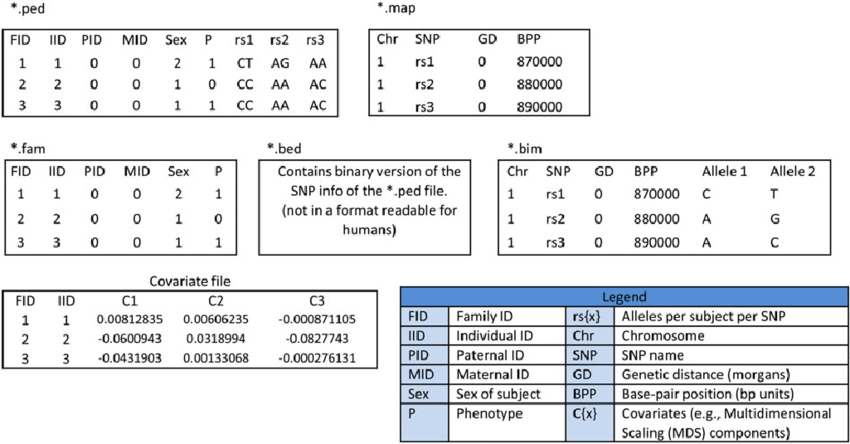

# Unidad 2: Genética de poblaciones con software especializado

Los **datos crudos** son las secuencias tal cual salen de la plataforma de secuenciación (Illumina, IonTorrent, PacBio, entre otros). Es decir los **reads** (lecturas).  Este tipo de datos son con los que alimentamos a nuestra pipeline de ensamblado o mapeo a genoma de referencia para eventualmente *llamar SNPs* y poder tener los diferentes alelos para miles de loci (genotipos) en cada uno de nuestros individuos.

En la siguiente sección del curso nos enfocaremos en cómo limpiar las secuencias, ensamblar *de novo*, mapear a un genoma de referencia y llamar SNPS. Pero antes en esta sección veremos la parte que en general verdaderamente nos interesa: hacer análisis de genética de poblaciones con los SNPs.

Los SNPs son **datos procesados** que ya contienen significado biológico (genotipos). Dependiendo del **tipo de procesamiento** y del **software** que se utilizó los datos procesados podrán pasar del formato .fastq (y considerarse meramente *reads*) a un **formato específico**, que muchas veces están vinculados a un sofware. Los datos procesados en dicho formato específico serán a su vez el *input* de nuevos análisis, por ejemplo de genómica de poblaciones, genómica comparativa, filogenética, entre otros. 

Muchos formatos están asociados a un programa en particular, aunque los más usados son relativamente convencionales y ya pueden ser utilizados por otros programas y herramientas, por ejemplo paquetes de R o Biocondoctor.

Otros programas tienen sus propios formatos y hay que transformarlos manualmente (bueno, con la línea de comando) para analizarlos con otro software (lo cual puede ser doloroso).

Aquí nos vamos a enfocar en los formatos (y programas) [Plink](https://www.cog-genomics.org/plink/1.9/) y [VCF ](http://www.1000genomes.org/wiki/Analysis/variant-call-format), pues son bastante estándares, varios paquetes de R los pueden leer e incluyen su propio programa para realizar algunos análisis de genética de poblaciones.

## VCF

"Variant Call Format"
[Ref](http://samtools.github.io/hts-specs/VCFv4.2.pdf)

Formato para representar una posición en el genoma (posiblemente con variantes) y su información asociada. También puede contener información de genotipos de varias muestras para cada posición. 

Programa asociado: [VCFtools](https://vcftools.github.io/index.html) y [BCFtools](https://github.com/samtools/bcftools)

Ejemplo:

```
##fileformat=VCFv4.2
##fileDate=20090805
##source=myImputationProgramV3.1
##reference=file:///seq/references/1000GenomesPilot-NCBI36.fasta
##contig=<ID=20,length=62435964,assembly=B36,md5=f126cdf8a6e0c7f379d618ff66beb2da,species="Homo sapiens",taxonomy=x>
##phasing=partial
##INFO=<ID=NS,Number=1,Type=Integer,Description="Number of Samples With Data">
##INFO=<ID=DP,Number=1,Type=Integer,Description="Total Depth">
##INFO=<ID=AF,Number=A,Type=Float,Description="Allele Frequency">
##INFO=<ID=AA,Number=1,Type=String,Description="Ancestral Allele">
##INFO=<ID=DB,Number=0,Type=Flag,Description="dbSNP membership, build 129">
##INFO=<ID=H2,Number=0,Type=Flag,Description="HapMap2 membership">
##FILTER=<ID=q10,Description="Quality below 10">
##FILTER=<ID=s50,Description="Less than 50% of samples have data">
##FORMAT=<ID=GT,Number=1,Type=String,Description="Genotype">
##FORMAT=<ID=GQ,Number=1,Type=Integer,Description="Genotype Quality">
##FORMAT=<ID=DP,Number=1,Type=Integer,Description="Read Depth">
##FORMAT=<ID=HQ,Number=2,Type=Integer,Description="Haplotype Quality">
#CHROM POS     ID        REF    ALT     QUAL FILTER INFO                              FORMAT      NA00001        NA00002        NA00003
20     14370   rs6054257 G      A       29   PASS   NS=3;DP=14;AF=0.5;DB;H2           GT:GQ:DP:HQ 0|0:48:1:51,51 1|0:48:8:51,51 1/1:43:5:.,.
20     17330   .         T      A       3    q10    NS=3;DP=11;AF=0.017               GT:GQ:DP:HQ 0|0:49:3:58,50 0|1:3:5:65,3   0/0:41:3
20     1110696 rs6040355 A      G,T     67   PASS   NS=2;DP=10;AF=0.333,0.667;AA=T;DB GT:GQ:DP:HQ 1|2:21:6:23,27 2|1:2:0:18,2   2/2:35:4
20     1230237 .         T      .       47   PASS   NS=3;DP=13;AA=T                   GT:GQ:DP:HQ 0|0:54:7:56,60 0|0:48:4:51,51 0/0:61:2
20     1234567 microsat1 GTC    G,GTCT  50   PASS   NS=3;DP=9;AA=G                    GT:GQ:DP    0/1:35:4       0/2:17:2       1/1:40:
```

### Ejemplos con VCF

Utilizaremos archivos VCF generados por la iniciativa ChileGenomico que se encuentran en esta ruta del servidor `genoma.med.uchile.cl`

```bash
$ cd /datos/compartido/ChileGenomico/
$ ls -lh *vcf*
-rwxr-x--- 1 filesadmin datagroup 427M Sep 23 18:32 CLG_Seq18_imp.masked.W05.SNPs.vcf
-rwxr-x--- 1 filesadmin datagroup 2.5G Sep 23 18:30 GATK_ChGdb_recalibrated.autosomes.12262013.snps.known.vcf
-rwxr-x--- 1 filesadmin datagroup 475M Sep 23 18:30 GATK_ChGdb_recalibrated.autosomes.12262013.snps.known.vcf.gz
```

Como pueden ver, hay dos archivos con el mismo nombre pero distintos sufijos: `vcf` y `vcf.gz`. El segundo archivo es una versión comprimida del archivo que fue generado con `gzip`.

### Directorio de trabajo

Crea un directorio `Unidad2/Prac_Uni5/data` dentro de tu repositorio para realizar los análisis de datos de esta unidad.

### Ejecución de vcftools

En el servidor `genoma.med.uchile.cl`

```
$ module load vcftools
$ vcftools
```

Si instalas `vcftools` en tu computador personal dentro de un contenedor de **docker**, realiza lo siguiente. Recuerda correr vcftools en un contenedor **montando un volumen** (`-v`) y borrándolo cuando termine de correr (`--rm`):

```
docker run --rm -v /RutaAbsolutaA/Unida2/Prac_Uni5/wolves:/data biocontainers/vcftools:0.1.15 vcftools -help
```

Por facilidad, puedes poner la parte que repetiremos cada vez que queramos correr vcftools (lo anterior hasta "vcftools") en una variable.

```
vcftools="docker run --rm -v /RutaAbsolutaA/Unida2/Prac_Uni5/:/data biocontainers/vcftools:0.1.15 vcftools"
```

y luego correrlo con `$vcftools` más el comando que quieras. Ejemplo: `$vcftools -help`.

### ¿Cómo empezar?

El mejor punto de partida son el [tutorial oficial](https://vcftools.github.io/documentation.html) y el [manual de VCFtools](https://vcftools.github.io/man_latest.html) para encontrar la guía completa de cada argumento disponible (son muchos y siempre necesitamos revisarlo, probar, y asegurarnos de que estamos realmente haciendo lo que queremos hacer).

**Ejercicios**

Consulta el [manual de VCFtools](https://vcftools.github.io/man_latest.html) y escribe un script que responda lo siguiente para el archivo `GATK_ChGdb_recalibrated.autosomes.12262013.snps.known.vcf ` **sin copiarlo a su directorio**:

1. ¿Cuántos individuos y variantes (SNPs) tiene el archivo?
1. ¿Cuántos sitios del archivo no tienen datos perdidos?
1. Genera un archivo en tu carpeta de trabajo llamado que contenga solo SNPs en una ventana de 2Mb en cualquier cromosoma. Nombra el archivo`CLG_Chr<X>_<Start>-<End>Mb.vcf` donde <X> es número del cromosoma, <Start> es el inicio de la ventana genómica y <End> es el final en megabases.
1. Reporta cuántas variantes tienen el archivo generado
1. Reporta la cobertura promedio para todos los individuos del set de datos
1. Calcula la frecuencia de cada alelo para todos los individuos dentro del archivo y guarda el resultado en un archivo
1. Filtra el archivo de frecuencias para solo incluir variantes bialélicas (tip: awk puede ser útil para realizar esta tarea, tip2:  puedes usar bcftools para filtrar variantes con más de dos alelos antes de calcular las frecuencias)
1. Llama a un script escrito en lenguaje R que lee el archivo de frecuencias de variantes bialélicas y guarda un histograma con el espectro de MAF para las variantes bialélicas
1. ¿Cuántos sitios tienen una frecuencia del alelo menor <0.05?
1. Calcula la heterocigosidad de cada individuo.
1. Calcula la diversidad nucleotídica por sitio.
1. Filtra los sitios que tengan una frecuencia del alelo menor <0.05
1. Convierte el archivo `wolves_maf05.vcf` a formato plink. 

## Plink

También representa SNPs de hasta miles de individuos, pero con menos información de cada variante. Está enfocado en el análisis de familias y los fenotipos asociados a individuos, pero es útil para manejo de datos en general y muchos otros programas lo cupan de input [Ref](https://www.cog-genomics.org/plink/1.9/)

Programa asociado: [Plink](http://pngu.mgh.harvard.edu/~purcell/plink/) y [Plink1.9](https://www.cog-genomics.org/plink/1.9/)

En realidad hay varios [tipos de formato plink](https://www.cog-genomics.org/plink/1.9/formats), y normalmente no son uno sino **varios archivos**. 

La manera de manejar los formatos cambió un poco entre las versiones <1.9 y 1.9. Siguen siendo compatibles, pero aguas.

**NOTA** Para poder usar Plink recuerda que debes descargar el programa utilizando un wget (de acuerdo a tu sistema operativo Mac, Linux, etc.), descomprimir el directorio, ir al directorio bin y utilizar `./plink` para ejecutar el programa. NO olviden el ./ que nos permite decir la ubicación del ejecutable.

**OJO**, si quieres poder correr plink desde cualquier sitio en tu computadora debes agregar la ruta del ejecutable a tu path. Para hacerlo primero utilizamos `pwd` para obtener la ruta ABSOLUTA del lugar donde se encuentra nuestro ejecutable. Por ejemplo en nuestro usuario de acceso al cluster es `/home/cirio` (RECUERDA QUE LA RUTA ABSOLUTA CAMBIA DE ACUERDO A TU COMPUTADORA). Una vez que sabemos que es correcta la ruta la podemos agregar al PATH (lugar con rutas de diferentes scripts que ejecutan programas instalados en tu computadora/cluster). La manera es escribiendo `export PATH=$PATH:/home/cirio`, comando en el que se incluye la RUTA ABSOLUTA.

### Plink text (`ped`)

Consta de min 2 archivos: 

`.ped` que contiene los SNPs

```
plink.ped:
  1 1 0 0 1  0  G G  2 2  C C
  1 2 0 0 1  0  A A  0 0  A C
  1 3 1 2 1  2  0 0  1 2  A C
  2 1 0 0 1  0  A A  2 2  0 0
  2 2 0 0 1  2  A A  2 2  0 0
  2 3 1 2 1  2  A A  2 2  A A
```

`.map` que contiene la localización de esos SNPs

```
plink.map:
  1 snp1 0 1
  1 snp2 0 2
  1 snp3 0 3
```

### Plink 1 binario (`bed`)

Es una versión binaria de lo anterior. Consta de 3 archivos:

`.bed` (PLINK binary biallelic genotype table). Ojo, no confundir con el `BED` que vimos arriba.

`.bim` que contiene las bases originales de cada SNP

```
plink.bim  
  1  snp1  0  1  G  A
  1  snp2  0  2  1  2
  1  snp3  0  3  A  C
```

`.fam` (PLINK sample information file) que contiene info de las muestras. Una línea por muestra con la siguiente info:

    Family ID ('FID')
    Within-family ID ('IID'; cannot be '0')
    Within-family ID of father ('0' if father isn't in dataset)
    Within-family ID of mother ('0' if mother isn't in dataset)
    Sex code ('1' = male, '2' = female, '0' = unknown)
    Phenotype value ('1' = control, '2' = case, '-9'/'0'/non-numeric = missing data if case/control)

### Resumen de formatos Plink



Plink está pensado para datos humanos (de ahí lo de familia, madre, sexo, etc), pero es posible tener datos en formato plink sin ese tipo de información. 

Muchos programas de genética de poblaciones y R utilizan plink para correr. 

**Plink `raw`** (additive + dominant component file)

Es un formato producido por Plink para realizar análisis en R (pero no en Plink).

Contenido:

Header line y luego una línea por muestra con: 

```
V+6 (for '--recode A') or 2V+6 (for '--recode AD') fields, where V is the number of variants. 
FID    Family ID
IID    Within-family ID
PAT    Paternal within-family ID
MAT    Maternal within-family ID
SEX    Sex (1 = male, 2 = female, 0 = unknown)
PHENOTYPE    Main phenotype value
```

Ejemplo:

```
FID    IID    PAT    MAT    SEX    PHENOTYPE    abph1.15_G    ae1.8_A    an1.3_A    ba1.5_G    ba1.7_A    csu1138.4_A    csu1171.2_A    Fea2.2_A    fea2.3_G    MZB00125.2_A    pbf1.3_G
1    maiz_3    0    0    0    -9    2    0    0    2    0    0    2    0    0    0    0
2    maiz_68    0    0    0    -9    0    0    2    1    0    0    0    0    0    0    0
3    maiz_91    0    0    0    -9    2    0    0    0    0    0    2    0    0    1    0
```

### Ejemplos con plink

En la ruta `/datos/compartido/ChileGenomico/` encontrarás varios archivos plink y un archivo de matainformación (`popinfo`). 

```
$ ls -lh /datos/compartido/ChileGenomico/chilean_all48_hg19*
-rw-r--r-- 1 filesadmin datagroup 9.4M Apr 26  2023 /datos/compartido/ChileGenomico/chilean_all48_hg19.bed
-rw-r--r-- 1 filesadmin datagroup  23M Apr 26  2023 /datos/compartido/ChileGenomico/chilean_all48_hg19.bim
-rw-r--r-- 1 filesadmin datagroup 1.1K Apr 26  2023 /datos/compartido/ChileGenomico/chilean_all48_hg19.fam
-rw-r--r-- 1 filesadmin datagroup 4.0K Sep 24 12:44 /datos/compartido/ChileGenomico/chilean_all48_hg19_popinfo.csv
```

Copia esos archivos a tu respositorio en una carpeta para la sesión `Unididad2/Prac_Uni5/data`  y contesta lo siguiente **asumiendo que tu WD es `Unididad2/Sesion1/code` (y no `data`).**

1) Enlista los archivos plink que hay en `data`.  ¿Qué tipos de archivos son cada uno?

2) Consulta el manual de [plink1.9](https://www.cog-genomics.org/plink/1.9/formats) y contesta utilizando comandos de plink lo siguiente. Deposita cualquier arquico que generes an una carpeta `Unididad2/Prac_Uni5/results`:

a) Transforma de formato bed a formato ped (pista: sección Data Managment). El nombre del output debe ser igual, solo cambiando la extensión.

```
$ plink --bfile ../data/chilean_all48_hg19 --recode --out ../results/chilean_all48_hg19
```

b) Crea otro archivo ped (ojo PPPPed) pero esta vez filtrando los SNPs cuya frecuencia del alelo menor sea menor a 0.05 Y filtrando los individuos con más de 10% missing data. Tu output debe llamarse maicesArtegaetal2015_maf05_missing10

¿Cuántos SNPs y cuántos individuos fueron removidos por los filtros?

```
$ plink --bfile ../data/chilean_all48_hg19 --recode --maf 0.05  --mind 0.1 --out ../results/chilean_all48_hg19_maf05_missing10
```

c) Realiza un reporte de equilibrio de Hardy-Weinberg sobre el archivo `chilean_all48_hg19_maf05_missing10` creado en el ejercicio anterior. El nombre del archivo de tu output debe contener chilean_all48_hg19_maf05_missing10.

```
plink --file ../results/chilean_all48_hg19_maf05_missing10 --hardy --out ../results/chilean_all48_hg19_maf05_missing10
```

Observa el output y discute que es cada columna.

```
head ../results/chilean_all48_hg19_maf05_missing10.hwe
10.hwe
 CHR                          SNP     TEST   A1   A2                 GENO   O(HET)   E(HET)            P
   1                    rs9701055      ALL    T    C              18/0/28        0   0.4764    5.994e-14
   1                    rs9701055      AFF    T    C                0/0/0      nan      nan            1
   1                    rs9701055    UNAFF    T    C              18/0/28        0   0.4764    5.994e-14
   1                    rs9701055      ALL    T    C              0/16/28   0.3636   0.2975       0.3137
   1                    rs9701055      AFF    T    C                0/0/0      nan      nan            1
   1                    rs9701055    UNAFF    T    C              0/16/28   0.3636   0.2975       0.3137
   1                    rs2073813      ALL    A    G              0/17/28   0.3778   0.3064       0.3197
   1                    rs2073813      AFF    A    G                0/0/0      nan      nan            1
   1                    rs2073813    UNAFF    A    G              0/17/28   0.3778   0.3064       0.3197
```

d) Observa el archivo `maicesArtegaetal2015.fam`. Consulta la documentación de plink para determinar que es cada columna. ¿Qué información hay y no hay en este archivo?

```
$ head ../data/chilean_all48_hg19.fam
CDSJ177 CDSJ177 0 0 1 1
CDSJ021 CDSJ021 0 0 1 1
ARI006 ARI006 0 0 1 1
ARI021 ARI021 0 0 1 1
ARI022 ARI022 0 0 2 1
CDSJ174 CDSJ174 0 0 1 1
CDSJ175 CDSJ175 0 0 1 1
CDSJ046 CDSJ046 0 0 1 1
CDSJ176 CDSJ176 0 0 1 1
CDSJ469 CDSJ469 0 0 2 1
```

4) Utiliza la info el archivo `data/chilean_all48_hg19_popinfo.csv` y el comando `update-ids` de plink para cambiar los nombres de las muestras de `data/chilean_all48_hg19.fam` de tal forma que el family ID corresponda a la info de la columna `Categ.Altitud` en `maizteocintle_SNP50k_meta_extended.txt`. Pista: este ejercicio requiere varias operaciones, puedes dividirlas en diferentes scripts de bash o de R y bash. Tu respuesta debe incluir todos los scripts (y deben estar en /code). 
5) Realiza un cuna comparación entre el sexo y archivo `fam`y el `popinfo` y calcula la proporción de discordancias
6) Realiza un test de estimación de sexo usando plink y reporta los resultados en formato de tabla para todos los individuos con discordancia entre el sexto reportado en `fam` y el calculado con plink.
7) Genera una tabla de contingencia de individuos por sexo y ancestría (hint: ver columna Ancestry en el archivo `popinfo`)

## 
