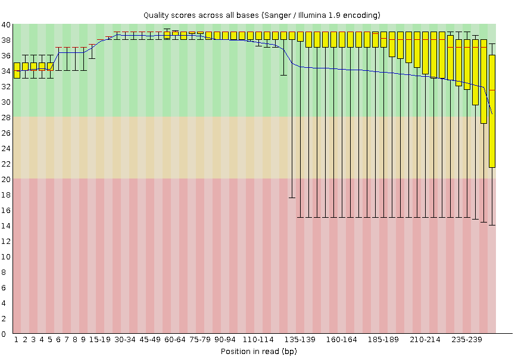

#### Tutorial: Control de calidad de lecturas NGS

Las lecturas crudas obtenidas del secuenciador en Next Generation Sequencing (NGS) pueden contener secuencias de adaptadores usados en la secuenciación, contaminantes y sitios con bajas calidades.

Comúnmente en el extremo 3' de las lecturas posee una menor calidad que el extremo 5'.

El procesamiento de las lecturas para eliminar las secuencias pertenecientes a adaptadores y los pares de bases con baja calidad se denomina Trimming.

Para realizar un trimming adecuado de lecturas se debe hacer un análisis previo de la calidad de la secuenciación mediante el programa FastQC.

1. Conectarse al Servidor
   `ssh -Y bioinfo1@genoma.med.uchile.cl`
   La contraseña fue proyectada en clase, pregunten en gitter si no la recuerdan.

2. Usando las lecturas crudas de una secuenciación NGS ejecute FastQC:
   Los datos están en Datos: `181004_curso_calidad_datos_NGS/fastq_raw`

3. Cree y entre a un directorio con su inicial y apellido. Ejemplo:
   
   ```
   mkdir jperez
   cd jperez
   ```

4. Ejecute FastQC de la siguiente forma para un archivo fastq (contiene las lecturas crudas):

`$ fastqc “archivo_fastq” -o “directorio_salida” `

   Ejemplo de una muestra usando las lecturas crudas:

`$ fastqc ../181004_curso_calidad_datos_NGS/fastq_raw/S3_R1.fastq.gz -o . `

   El punto al final es importante (significa, usar este directorio para el resultado)

#### 4. Análisis luego de la poda

Se realiza una poda de los datos para eliminar adaptadores, lecturas con  la secuencia del fago PhiX y lecturas con una calidad baja.

1. Usando las filtradas, ejecute FastQC para contrastar las diferencias tras el filtro:
   Datos: `bioinfo1/181004_curso_calidad_datos_NGS/fastq_filter`

2. Ejemplo de la muestra anterior usando las lecturas filtradas:

`$ fastqc ../181004_curso_calidad_datos_NGS/fastq_filter/S3_R1_filter.fastq.gz -o .`

|                   |
|:--------------------------------------------------------------:|
| *Imagen de la calidad de las secuencias generada por FastQC. * |

#### 5. Tarea

Realizar las siguientes tareas tanto para las secuencias crudas y podadas. Además de generar los informes de calidades deben realizar una comparación de los 
resultados. Recuerden que la ubicación de las secuencias crudas 
es en el directorio: 181004_curso_calidad_datos_NGS/fastq_raw/ y las secuencias ya podadas se encuentran en 181004_curso_calidad_datos_NGS/fastq_filter

1. Usando comandos Unix:
   
   * Contar el número de lecturas (reads) en un archivo fastq
   * Previsualizar las primeras 40 líneas del mismo archivo fastq
   * Ubicar la lectura 3 e identificar la información disponible. Describir en detalle la información entregada. ¿Donde se entrega la calidad del read?, ¿Cuál es el ID (identificador) del read? Etc. Utilice fechas y etiquetas para identificar cada parte.
   * Traducir el código de calidad para las primeras 10 bases del tercer read a valores numéricos (Q) usando la codificación entregada en clase.

2. Genere un informe de calidad con FastQC para una muestra (cada estudiante una muestra distinta), para R1 y R2.

3. Baje los archivos HTML a su computados mediante sftp (puede usar cualquier cliente o la línea de comandos. Por ejemplo, ejecutando desde su computador local:
   `scp  bioinfo1@genoma.med.uchile.cl:ricardo/S3_R1_fastqc* .  `
   
   Nota: el punto al final es importante, porque dice que los archivos deben copiarse en el directorio actual (en el computador local).
   Nota 2: el asterisco significa cualquier caracter(es) y permite hacer match con múltiples archivos.

4. Analice el informe de calidad creado con fastqc para las lecturas R1 y R2.

5. Compare los valores calculados en el punto 1 con lo entregado en el informe de calidad obtenido con FastQC

6. Seleccione las 4 figuras más importantes a su criterio para analizar la calidad de la corrida, cópielas a un archivo Markdown en su repositorio y agregue su interpretación de cada figura.
   Recuerde hacer la comparación de R1 y R2 para las secuencias crudas y las secuencias podadas.

7. Incluya la identificación necesaria al inicio del reporte, incluyendo su nombre del curso, Tarea 1 de la Unidad 3, su nombre, y fecha.

** Forma de entrega: repositorio personal en GitHub **
