# cBioPortal para analizar datos genómicos de cáncer

## Autor: Karen Oróstica, PhD

## Introducción

cBioPortal es una plataforma interactiva de análisis y visualización de datos genómicos de cáncer, desarrollada por el Memorial Sloan Kettering Cancer Center (MSKCC).

Su objetivo principal es facilitar la exploración de alteraciones genéticas, transcriptómicas y clínicas en distintos tipos de cáncer, integrando información proveniente de grandes consorcios internacionales como:

- TCGA (The Cancer Genome Atlas)
- PCAWG (Pan-Cancer Analysis of Whole Genomes)
- METABRIC, CPTAC, GENIE, y otros.

cBioPortal es gratuito, de acceso abierto y ampliamente utilizado tanto por investigadores como por clínicos para identificar mutaciones relevantes, correlacionar datos moleculares con variables clínicas y explorar biomarcadores de interés.

Acceso: <https://www.cbioportal.org>

## Navegación por la página principal

Cuando entras a [cbioportal.org:](http://cbioportal.org)

- Se presenta una lista central de estudios disponibles (más de 500). Cada fila en esta lista incluye:
  - Nombre del estudio
  - Institución responsable
  - Número de muestras o pacientes incluidos
  - Tipo de tumor o tejido analizado
  - Clasificación de los estudios

Los estudios PanCancer incluyen múltiples tipos de cáncer. Los estudios específicos de un tejido u órgano se agrupan en el menú lateral izquierdo bajo su respectiva categoría (por ejemplo, Lung, Pancreas, Breast, etc.).

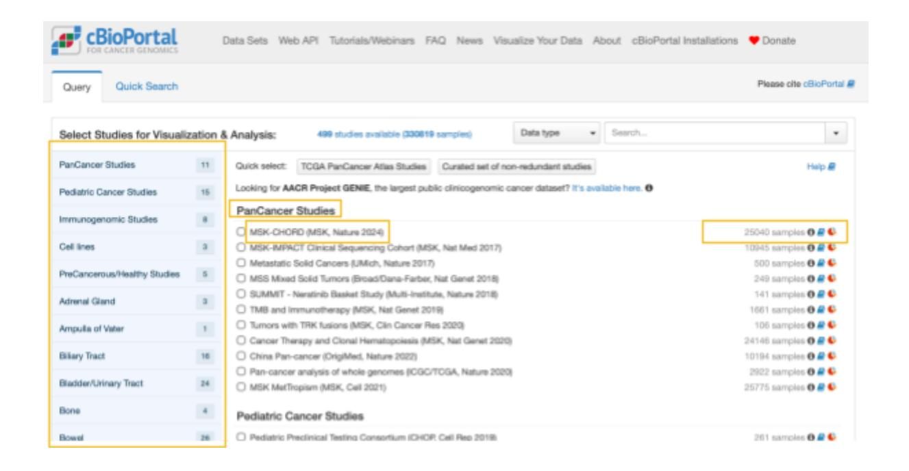

### Ejemplo

Si se desea buscar estudios sobre cáncer de páncreas (tiene 18 estudios asociados), basta con seleccionar "Pancreas" en el menú izquierdo.

Allí aparecerán, por ejemplo:

- Pancreatic Adenocarcinoma (MSK, Nat Med 2024)
- Pancreatic Cancer (CPTAC GDC, 2025)
- Pancreatic Cancer (MSK, Cancer Cell 2024)
- Pancreatic Neuroendocrine Tumors (MSK, 2023)

Estos estudios están organizados según el subtipo de cáncer pancreático, como adenocarcinoma pancreático o tumores neuroendocrinos pancreáticos.

Si, por ejemplo, estás interesado en el estudio "Pancreatic Cancer (MSK, Cancer Cell 2024)", puedes:

- Marcar la casilla que se encuentra junto al nombre del estudio.
- Presionar el botón "Explore Selected Studies" (Explorar estudios seleccionados).
- La página se actualizará automáticamente, cargando solo la información correspondiente a ese estudio específico.

A partir de allí, podrás acceder a los distintos paneles del análisis —como Summary, Mutations, Plots o Clinical Data— y comenzar a explorar los datos genómicos, transcriptómicos y clínicos de los pacientes incluidos.

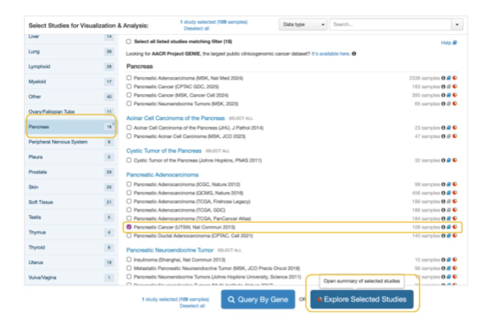

### Pestaña "Summary" (Resumen)

Una vez que hayas seleccionado un estudio para explorar en cBioPortal, entrarás a la página principal del estudio. El nombre del estudio aparece en la parte superior de la página, junto con varias pestañas.

En la pestaña Summary (Resumen), encontrarás distintos cuadros que muestran datos que van desde información demográfica, hasta genética y de tratamientos. Estos datos se presentan en forma de gráficos, diagramas o tablas, dependiendo del tipo de información que se esté mostrando.

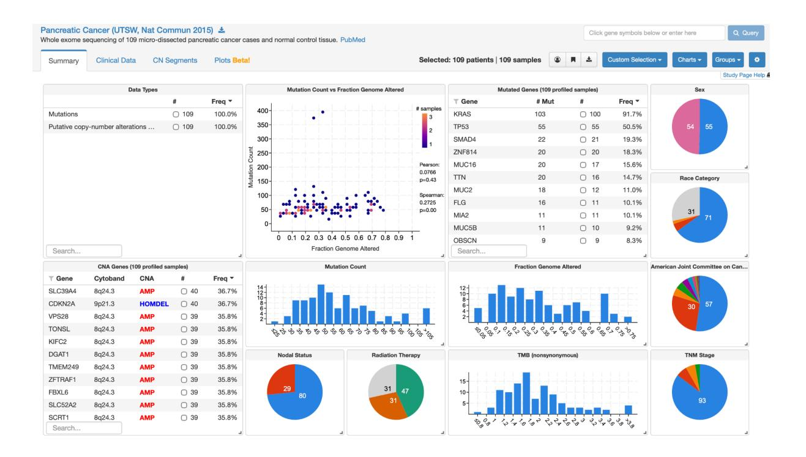

### Modificar los datos mostrados en la pestaña "Summary"

Los datos que se muestran en esta página pueden modificarse usando el botón "Charts" (Gráficos), ubicado en la esquina superior derecha.

Al hacer clic en Charts, aparece un menú con casillas de verificación.

- Las casillas marcadas indican los datos que actualmente se muestran en la página.
- Las casillas sin marcar corresponden a datos que no se muestran.

Observa que los datos están agrupados por tipo de información, ya sea clínica o genómica, y organizados bajo pestañas.


##### Agregar nuevos datos a la pestaña "Summary"

Para agregar un tipo de dato al resumen, haz clic en la casilla de verificación, como se muestra, y la información aparecerá automáticamente en la página. Para quitarla, simplemente desmarca la casilla.

Ten en cuenta que no todos los estudios incluyen todos los tipos de datos. Solo se pueden mostrar en la pestaña Summary aquellos datos que realmente fueron recopilados en el estudio. La frecuencia que aparece en los gráficos representa el número de muestras incluidas en ese estudio que contienen ese tipo de información.

### Eliminar datos directamente desde la pestaña "Summary"

También puedes eliminar un gráfico directamente desde la página del estudio. Por ejemplo, enfoquémonos en el histograma llamado "Mutation Count" (Conteo de mutaciones). Si no queremos ver este gráfico,

podemos pasar el cursor sobre él y veremos aparecer una pequeña "X" con la etiqueta "Delete Chart" (Eliminar gráfico). Haz clic en esa "X" y el gráfico desaparecerá. Más tarde, si deseas volver a mostrarlo, solo debes ir nuevamente al menú Charts, buscar la categoría Genomic data (Datos genómicos) y seleccionar Mutation Count para que reaparezca en la página del estudio

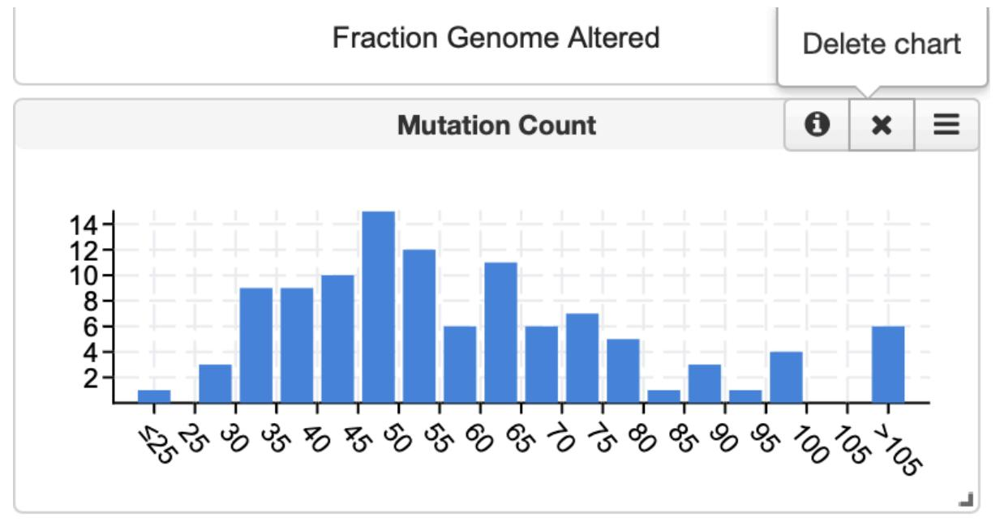

## Navegación en la pestaña "Clinical Data" (Datos clínicos)

Además de la pestaña Summary, otra sección de gran interés es la pestaña Clinical Data. Al navegar a esta pestaña, verás una lista de muestras y pacientes incluidos en el estudio.A cada muestra y paciente se les asigna un ID (identificador) para mantener el anonimato.

En este estudio en particular, se utilizó una muestra por paciente para los análisis genéticos, por lo tanto, los IDs de muestra y de paciente coinciden.

En la pestaña Clinical Data, los datos se muestran en una tabla grande.

Estos datos varían según el estudio,pero generalmente incluyen información demográfica relevante, como:

- sexo
- raza
- edad al momento del diagnóstico
- así como también datos genéticos, por ejemplo, el conteo de mutaciones.

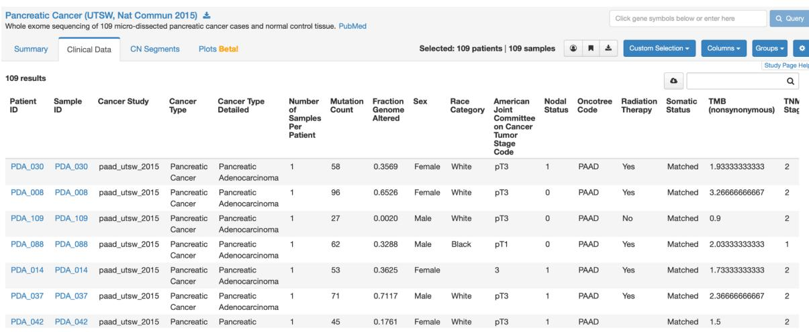

### Datos individuales de pacientes

Si haces clic en el ID del paciente, se abrirá una nueva ventana. En esa página encontrarás información más detallada sobre el paciente y sus datos genéticos recopilados en el estudio.

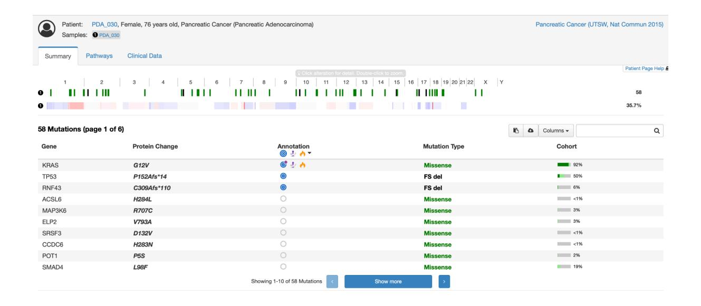

### Tipos de datos demográficos

Los datos demográficos, también llamados datos clínicos, se presentan en la pestaña Summary (Resumen) de la página de un estudio de cáncer en cBioPortal. Estos datos incluyen: el sexo, la raza, y la edad al momento del diagnóstico, además de otros parámetros dependiendo del estudio.

Puedes confirmar qué tipos de datos están visibles haciendo clic en el menú "Charts" (Gráficos) ubicado en la esquina superior derecha de la página, y luego revisando la sección Clinical Data (Datos clínicos).

Como se puede observar, este estudio incluye información sobre: sexo, raza, y edad al diagnóstico. Si observas más de cerca cada categoría demográfica, podrás obtener detalles adicionales.

### Interpretación de los datos de sexo

En la página encontrarás un gráfico circular (pie chart) que representa la distribución por sexo de los pacientes incluidos en el estudio.

Dentro de cada sector del gráfico aparece una cifra que indica el número de pacientes que pertenecen a esa categoría. Si pasas el cursor sobre el gráfico, aparecerá una ventana emergente con información adicional.

Esta ventana indica que: el color rosado representa a las mujeres, y el color azul representa a los hombres.

Además, muestra el porcentaje de pacientes que pertenecen a cada categoría de sexo. Este porcentaje se denomina frecuencia, abreviado como FREQ, que aparece en la parte superior del recuadro.

En este caso, el 50,5% de los participantes son hombres, y el 49,5% son mujeres.

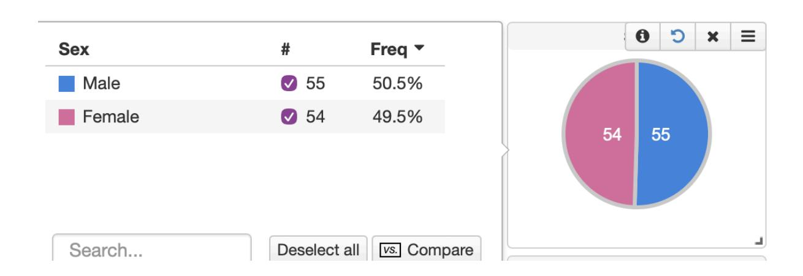

### Interpretación de los datos de raza

La categoría de raza también se presenta como un gráfico circular. Debido al tamaño de algunos sectores del gráfico, no siempre aparecen los números sobre cada porción. Por eso es importante pasar el cursor sobre el gráfico, para identificar qué representa cada color, así como el porcentaje (frecuencia) de pacientes en cada categoría racial.

Por ejemplo, se observa que 31 pacientes pertenecen a la categoría NA, lo que significa que no se recopilaron datos de raza para ese subconjunto de pacientes.

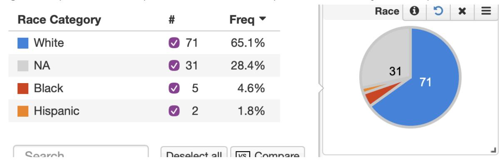

### Interpretación de los datos de edad al diagnóstico

La edad al momento del diagnóstico se presenta en un histograma. Cada barra del gráfico indica el número de pacientes que pertenecen a un rango etario específico, tal como se muestra en el eje X.

El eje Y representa la frecuencia, es decir, el número total de pacientes dentro de cada rango de edad. Puedes pasar el cursor sobre las barras para ver un recuadro con el número exacto de pacientes en ese rango de edad.

Por ejemplo, al pasar el cursor sobre la barra más alta, se revela que hay 23 pacientes cuyo rango de edad al diagnóstico fue entre 65 y 70 años.

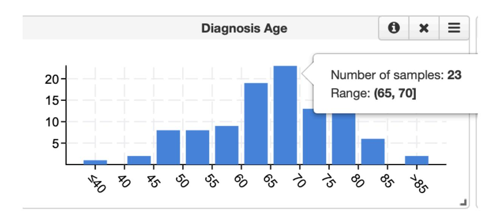

El rango es un valor estadístico que describe la diferencia entre el valor máximo y el mínimo dentro de un conjunto de datos.

En el contexto de la edad al diagnóstico, el rango representa la distancia entre el paciente más joven y el más viejo incluidos en el estudio.

Por ejemplo, si ordenáramos todas las edades de los pacientes de menor a mayor, podríamos identificar fácilmente la edad mínima y la máxima, y luego calcular el rango restando la menor de la mayor.

En el caso mostrado, el cálculo sería 86 − 29 = 57 años, por lo tanto, el rango de edad al diagnóstico es de 57 años.

Para visualizar este rango directamente en cBioPortal, debemos ubicar el histograma de "Diagnosis Age" (Edad al diagnóstico) dentro de la pestaña Summary (Resumen) del estudio.

Al desplazarnos hacia la parte inferior de la página, encontraremos este gráfico, que permite tener una estimación visual del rango etario de los pacientes.

Sin embargo, los valores mostrados en el histograma suelen representarse de forma agrupada o aproximada, utilizando símbolos como "<" y ">" (por ejemplo, "<40" o ">85"), lo que impide conocer los valores exactos.

Para determinar con precisión las edades mínima y máxima, es posible utilizar una función adicional del gráfico:

- 1. Pasa el cursor sobre el recuadro del histograma hasta que aparezca el menú de tres líneas (también conocido como menú hamburguesa) en la esquina superior derecha.
- 2. Selecciona la opción Compare Groups (Comparar grupos).
- 3. Luego haz clic en Median (Mediana).

Aunque esta herramienta está diseñada para calcular la mediana, también permite identificar el rango completo.

Tras recargar la página, se mostrarán cuadrados rojos y azules, que representan dos grupos de pacientes:

- Los cuadrados rojos corresponden a los pacientes de mayor edad.
- Los cuadrados azules a los de menor edad.

En la leyenda lateral se indican los intervalos de edad de cada grupo.

Si observamos con detalle, veremos que la edad más alta corresponde a 86 años (grupo rojo) y la más baja a 29 años (grupo azul).

Por lo tanto, el rango de edad al diagnóstico para este estudio es de 57 años (86 − 29).

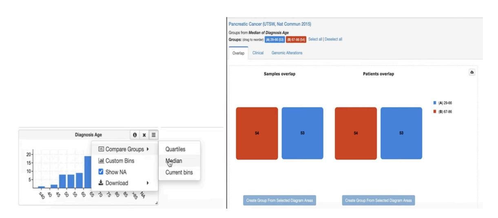

## Localización de la tabla "Mutated Genes" (Genes Mutados) en la pestaña Summary

Dado que cBioPortal es una base de datos de genómica del cáncer, los estudios disponibles incluyen información sobre variantes génicas identificadas en los pacientes del estudio.

En otras palabras, esta sección muestra qué genes fueron encontrados como mutados en el tejido tumoral de los pacientes analizados.

Para localizar estos genes, debemos buscar la tabla llamada "Mutated Genes" (Genes Mutados).

Por ejemplo, en este estudio sobre cáncer de páncreas, la tabla de genes mutados se encuentra en el lado derecho de la pestaña Summary (Resumen).

### Interpretación de la tabla "Mutated Genes"

Esta tabla contiene cuatro columnas principales, cada una con información diferente:

- Columna "Gene" (Gen):
- Muestra el nombre del gen.

Los genes suelen representarse mediante abreviaciones de pocas letras, a veces acompañadas de números.

Por ejemplo, el primer gen que aparece en la lista es KRAS (K-R-A-S).

- Columna "Number MUT" (Número de mutaciones): Indica el número total de mutaciones detectadas en las muestras del estudio para ese gen.
- Columna "Number" (Número de muestras): Representa la cantidad de muestras en las cuales se identificó la mutación. En este estudio, cada muestra proviene de un solo paciente, por lo que este valor puede interpretarse también como el número de pacientes que presentan mutaciones en ese gen.
- Columna "FREQ" (Frecuencia): Muestra el porcentaje de pacientes o muestras que presentan una mutación en ese gen, calculado respecto al total de pacientes incluidos en el estudio.

|                                      |       | - dl\                |        |
| ------------------------------------ | ----- | -------------------- | ------ |
| Mutated Genes (109 profiled samples) |       |                      |        |
| <b>▼</b> Gene                        | # Mut | #                    | Freq ▼ |
| KRAS                                 | 103   | ■ 100                | 91.7%  |
| TP53                                 | 55    | <b>5</b> 5           | 50.5%  |
| SMAD4                                | 22    | <ul><li>21</li></ul> | 19.3%  |
| ZNF814                               | 20    | <b>2</b> 0           | 18.3%  |
| MUC16                                | 20    | <ul><li>17</li></ul> | 15.6%  |
| TTN                                  | 20    | <b>1</b> 6           | 14.7%  |
| MUC2                                 | 18    | <ul><li>12</li></ul> | 11.0%  |
| FLG                                  | 16    | <ul><li>11</li></ul> | 10.1%  |
| MIA2                                 | 11    | <ul><li>11</li></ul> | 10.1%  |
| MUC5B                                | 11    | <b>1</b> 0           | 9.2%   |
| OBSCN                                | 9     | <ul><li>9</li></ul>  | 8.3%   |
| Search                               |       |                      |        |

##### Ejemplo con el gen KRAS

Veamos un ejemplo concreto.

El primer gen en la tabla es KRAS, y observamos que se identificaron 103 mutaciones en las muestras que fueron sometidas a perfil genético dentro del estudio. También se indica que hubo 100 pacientes con mutaciones en KRAS.

En principio, estos números parecen no coincidir, ya que si cada paciente entregó una sola muestra, sería lógico esperar 100 mutaciones en 100 pacientes.

Sin embargo, la diferencia indica que algunos pacientes presentan más de una mutación en el gen KRAS.

Por otro lado, al revisar la columna de frecuencia (FREQ), observamos que el 91,7% de los pacientes tienen mutaciones en KRAS.

Este valor se obtiene dividiendo 100 pacientes con mutaciones entre el total de 109 pacientes del estudio.

##### Uso de la barra de búsqueda en la tabla "Mutated Genes"

Otra función útil de esta tabla es la barra de búsqueda que se encuentra en la parte inferior.

Debido a que muchos estudios incluyen cientos o incluso miles de genes mutados, esta herramienta permite buscar rápidamente un gen específico.

Por ejemplo, si estuviéramos interesados en el gen PCLO, bastaría con escribir su nombre (P-C-L-O) en la barra de búsqueda.

Automáticamente, la tabla se filtrará y mostrará solo la información correspondiente al gen PCLO, ocultando el resto.

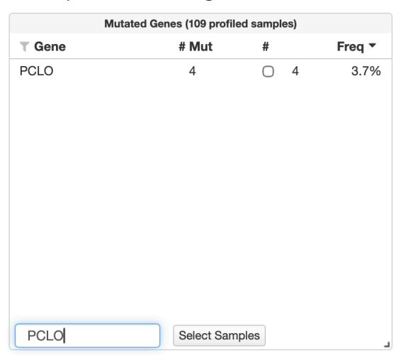

### Cuándo ordenar los datos de un estudio por gen

Hay ocasiones en que no se desea analizar todos los datos de un estudio, sino solo un subconjunto específico.

Por ejemplo, puedes estar interesado únicamente en los pacientes o muestras que presentan ciertas mutaciones genéticas, también llamadas variantes génicas. cBioPortal permite filtrar los datos para mostrar solo las muestras que contienen las mutaciones de interés.

Para hacerlo, debes navegar hasta la tabla "Mutated Genes" (Genes Mutados).

### Ejemplo de filtrado con el gen KRAS

Supongamos que solo te interesa ver los pacientes con mutaciones en el gen KRAS, el cual aparece como el primer gen listado en la tabla de genes mutados, con una frecuencia del 91,7%.

Para filtrar el estudio:

● Marca la casilla de verificación en la tercera columna de la tabla junto al nombre del gen KRAS.

● Luego, haz clic en el botón "Select Samples" (Seleccionar muestras) ubicado en la parte inferior de la tabla.

Al hacer esto, la página de resumen del estudio se recargará automáticamente.

A partir de ese momento, toda la información mostrada en la página corresponderá únicamente a las muestras con mutaciones en KRAS.

Puedes confirmar que el filtrado se aplicó correctamente observando dos indicadores:

- En la tabla "Mutated Genes", la frecuencia (FREQ) ahora muestra 100%, lo que significa que todas las muestras visibles tienen mutaciones en KRAS.
- En la parte superior, bajo el título del estudio, aparecerá un filtro activo para las mutaciones en KRAS.

Además, todos los gráficos, tablas y datos clínicos de la página Summary se actualizarán automáticamente,

mostrando solo la información de pacientes con mutaciones en KRAS.

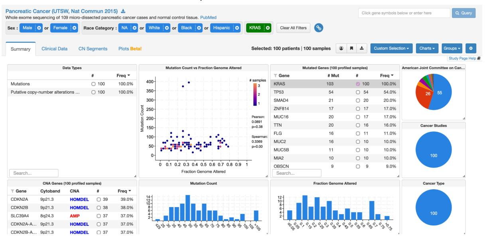

### Uso de la barra de búsqueda en la tabla "Mutated Genes"

En muchos estudios, la lista de genes mutados es muy extensa, pudiendo incluir cientos o incluso miles de genes.

Por eso, puede resultar poco práctico desplazarse manualmente en busca de un gen específico.

Para resolver esto, cBioPortal incluye una barra de búsqueda en la parte inferior de la tabla.

Antes de realizar una nueva búsqueda, es recomendable eliminar los filtros activos haciendo clic en "Clear all filters" (Borrar todos los filtros) y luego regresar a la tabla "Mutated Genes".

Por ejemplo, si ahora te interesa analizar el gen PCLO, escribe su nombre en la barra de búsqueda. Automáticamente, la tabla se filtrará para mostrar solo el gen PCLO.

A continuación, vuelve a marcar la casilla junto a su nombre y presiona nuevamente el botón "Select Samples". Esto filtrará el estudio para mostrar únicamente las muestras que presentan mutaciones en PCLO.

Como resultado, la frecuencia en la tabla volverá a indicar 100%, y toda la información en la página del estudio —incluyendo gráficos, tablas y datos clínicos— mostrará únicamente pacientes con mutaciones en el gen PCLO.

Si haces clic en la sección de datos clínicos, podrás comprobar que solo hay cuatro pacientes incluidos en esta categoría, todos ellos con mutaciones en PCLO.

## Navegación hacia la pestaña Clinical Data (Datos Clínicos)

En cBioPortal es posible acceder a la información correspondiente a pacientes individuales incluidos en un estudio.

Para visualizar los datos de un paciente en particular, debemos hacer clic en la pestaña Clinical Data (Datos Clínicos).

Al ingresar, se mostrará una lista de pacientes y muestras incluidas en el estudio. Identificadores de pacientes (Patient ID)

A cada paciente se le asigna un identificador (Patient ID) para garantizar el anonimato.

En este estudio, los identificadores comienzan con las letras PDA, seguidas de un número.

Además, dado que en este caso se tomó una sola muestra por paciente para realizar las pruebas genéticas, los IDs de muestra y de paciente coinciden, como se puede observar en la tabla.

### Datos mostrados en la pestaña Clinical Data

En esta pestaña, los datos se presentan en una gran tabla. El contenido puede variar según el estudio, pero generalmente incluye información clínica y demográfica relevante, como:

- Sexo
- Categoría racial
- Edad al diagnóstico

También puede contener datos genéticos, como el recuento de mutaciones (Mutation Count), además de información clínica complementaria, como:

- Etapa tumoral al momento del diagnóstico (Tumor Stage)
- Tratamientos o terapias recibidas, incluyendo, en este estudio particular, terapia de radiación.

### Acceder a los datos de un paciente individual

Para examinar los datos detallados de un paciente, basta con hacer clic en su ID. Al hacerlo, se abrirá una nueva ventana del navegador que muestra información más específica sobre ese paciente.

##### Pestaña Summary del paciente

La página inicial del paciente es la pestaña Summary (Resumen), donde se encuentra información genética detallada. En el centro de la página aparece una tabla con las variantes génicas detectadas en el tumor del paciente, es decir, la lista de genes mutados.

En este ejemplo, el paciente presenta 36 genes con mutaciones.

Los nombres de los genes aparecen con sus símbolos oficiales, compuestos por letras y números, en la columna izquierda bajo el título Gene (Gen).

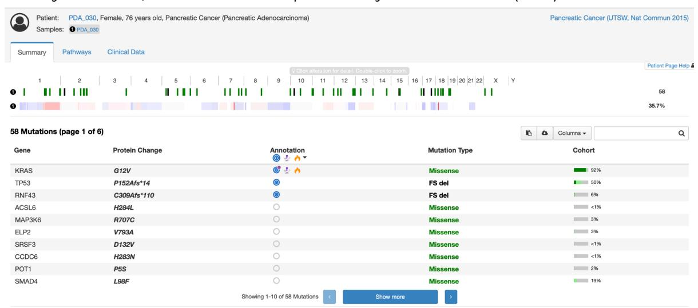

### Variantes génicas y cambios en proteínas

La siguiente columna indica el cambio proteico asociado a cada mutación.

Como los genes en esta lista son codificadores de proteínas, cada mutación produce un cambio en la secuencia de aminoácidos de la proteína correspondiente.

Por ejemplo, para el primer gen listado, KRAS, el cambio proteico está indicado como G12V. Esto significa que el aminoácido glicina (G), que normalmente ocupa la posición 12 de la secuencia proteica, ha sido reemplazado por una valina (V).

### Interpretación del tipo de mutación

La columna Mutation Type (Tipo de mutación) describe la naturaleza de cada cambio genético.

En el caso anterior, la mutación se clasifica correctamente como missense mutation (mutación de sentido erróneo), lo que implica un cambio de una sola base en el ADN que genera la sustitución de un único aminoácido en la proteína. Otros tipos de mutaciones que pueden encontrarse incluyen:

- Deleciones (DEL) o inserciones (INS), las cuales pueden alterar el marco de lectura.
- Las letras FS (frameshift) precediendo DEL o INS indican un cambio en el marco de lectura que provoca una proteína defectuosa.
- Nonsense mutations (mutaciones sin sentido), en las que un codón de parada prematuro reemplaza a un aminoácido,
- generando una proteína truncada o más corta de lo normal.

Por defecto, los genes se ordenan según su relevancia clínica,marcada con un símbolo de diana o bullseye bajo la columna Annotation (Anotación).

Para obtener más información sobre la significancia clínica, cBioPortal ofrece tutoriales adicionales en esta misma serie.

#### Ordenar la tabla de mutaciones

Es posible ordenar la tabla por cualquier columna. Por ejemplo, si queremos agrupar las mutaciones según su tipo, podemos hacer clic en el encabezado Mutation Type (Tipo de mutación). De este modo, veremos primero las deleciones con cambio de marco (frameshift deletions), luego las inserciones con frameshift, seguido de múltiples mutaciones missense, y finalmente, al final de la lista, las mutaciones nonsense.

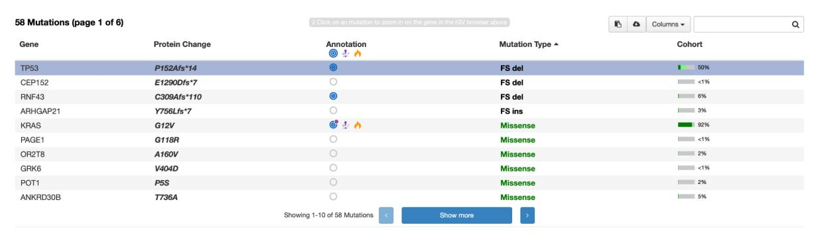

### Uso de la barra de búsqueda para encontrar un gen específico

También es posible buscar un gen particular dentro de la lista.

Por ejemplo, si se desea analizar el gen MCM4,

podemos escribir su nombre en la barra de búsqueda ubicada en la esquina superior derecha.

Al hacerlo, aparecerá el resultado mostrando que este paciente tiene una mutación missense en MCM4.

Si escribimos un gen que no está mutado, como BRCA1, la búsqueda devolverá el mensaje "No genes found" (No se encontraron genes). Además de las variantes génicas, la pestaña Summary también muestra dos secciones adicionales:

- Alteraciones en el número de copias (Copy Number Alterations, CNA)
- Visualización de las mutaciones en los cromosomas

### Visualización de mutaciones en cromosomas

Las Copy Number Alterations aparecen en la parte inferior de la página y representan grandes inserciones o deleciones de ADN, muy comunes en células cancerosas.

Si desplazamos la vista hacia la parte superior, encontraremos una visualización cromosómica.

Se muestra la lista de cromosomas humanos (1–22, X, Y), con dos filas debajo:

la primera corresponde a las mutaciones, y la segunda a las alteraciones en el número de copias.

Por ejemplo, en el cromosoma 1 se observa una mutación marcada con un recuadro verde y varias alteraciones de número de copias debajo.

Al hacer clic sobre el número del cromosoma, aparece un diagrama detallado que muestra los genes anotados como cuadros azules.

Si hacemos clic sobre la mutación, se despliega un recuadro indicando que se trata de una mutación missense en el gen RYR2, junto con su posición cromosómica exacta.

Desde un menú desplegable, también se puede cambiar a otros cromosomas para visualizar las mutaciones allí presentes.

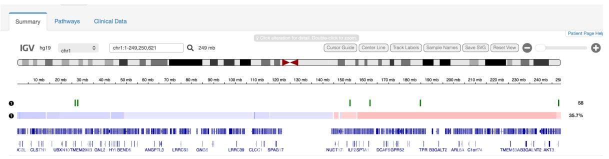

### Visualización en la pestaña Pathways (Vías de señalización)

Las mutaciones y los genes codificantes también pueden explorarse en la pestaña Pathways, que muestra las rutas de señalización celular donde actúan las proteínas alteradas.

En este ejemplo, el paciente presenta una mutación missense en KRAS, un gen comúnmente afectado en cáncer.

Al seleccionar la vía RTK-RAS, el gen KRAS aparece resaltado. Si pasamos el cursor sobre él, se indica la mutación G12V, que se encuentra en la proteína codificada por KRAS. Al observar el diagrama completo, se aprecia que esta vía regula procesos como proliferación celular, supervivencia y traducción, explicando cómo las mutaciones en KRAS contribuyen a la progresión del cáncer al alterar estas

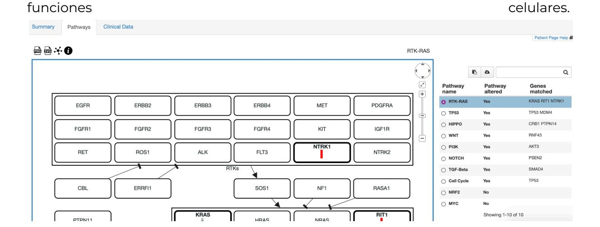

##### Pestaña Clinical Data del paciente individual

Finalmente, la pestaña Clinical Data del paciente contiene información demográfica y clínica adicional, complementando los datos genéticos mostrados anteriormente. Aquí se incluyen variables como:

- Tipo de cáncer,
- Etapa tumoral (Tumor Stage),
- Recuento total de mutaciones (Mutation Count), y otra información específica del tumor que fue sometido a análisis genético.


# 🧬 Tarea: Exploración e interpretación de datos genómicos en cBioPortal

### 29 de octubre

## 🎯 Objetivo

Explorar un estudio real disponible en [cBioPortal](https://www.cbioportal.org) para:

1. Analizar alteraciones genéticas en un tipo de cáncer específico,  
2. Filtrar pacientes con una mutación relevante, y  
3. Interpretar la información clínica y genómica obtenida.

---

## 🧩 Parte 1: Selección del estudio (15 min)

1. Ingresa a [https://www.cbioportal.org](https://www.cbioportal.org).  
2. Explora el listado de estudios y selecciona **un tipo de cáncer sólido** (por ejemplo: *Lung adenocarcinoma*, *Pancreatic cancer*, *Breast cancer*, *Colorectal cancer*).  
3. El estudio elegido debe tener **al menos 100 pacientes** y **datos genómicos y clínicos disponibles**.

**Completa la siguiente información:**

- **Nombre del estudio:**  
  
  > _Ejemplo: Pancreatic Cancer (MSK, Cancer Cell 2024)_

- **Número total de pacientes:**  
  
  > 

- **Institución responsable:**  
  
  > 

---

## 🧬 Parte 2: Análisis genómico (25 min)

1. Ve a la pestaña **Summary** del estudio.  
2. Localiza la tabla **“Mutated Genes”**.  
3. Identifica los **5 genes con mayor frecuencia de mutación**.

| #   | Gen | N° de mutaciones | N° de pacientes | Frecuencia (%) |
| --- | --- | ---------------- | --------------- | -------------- |
| 1   |     |                  |                 |                |
| 2   |     |                  |                 |                |
| 3   |     |                  |                 |                |
| 4   |     |                  |                 |                |
| 5   |     |                  |                 |                |

4. Selecciona **uno de esos genes** (ejemplo: *KRAS*, *TP53*, *PIK3CA*) y filtra las muestras (→ **Select Samples**).  
   Observa cómo cambian los gráficos del resumen.

**Responde:**

- ¿Cuántos pacientes presentan esa mutación?  
  
  > 

- ¿Qué tipo de mutación es más frecuente (missense, nonsense, frameshift)?  
  
  > 

- ¿Qué vías de señalización aparecen alteradas en la pestaña *Pathways*?  
  
  > 

---

## 👩‍⚕️ Parte 3: Análisis clínico (15 min)

1. Entra en la pestaña **Clinical Data**.  

2. Examina las variables demográficas:
   
   - Distribución por sexo  
   - Distribución por edad  
   - Distribución por raza (si está disponible)

3. Calcula:
   
   - **Rango de edad (edad máxima − edad mínima):**  
     
     > 
   
   - **Mediana de edad (usando “Compare Groups → Median”):**  
     
     > 

4. **Interpreta los resultados:**
   
   - ¿Existe una predominancia por sexo o edad?  
     
     > 
   
   - ¿Qué implicancias podría tener esa distribución para el estudio del cáncer elegido?  
     
     > 

---

## 🧠 Parte 4: Análisis interpretativo (10 min)

Redacta un breve comentario (5–10 líneas) respondiendo:

> ¿Qué relación observas entre las mutaciones más frecuentes y las características clínicas del grupo?  
> ¿Por qué podría ser relevante este gen como biomarcador o diana terapéutica?

_Respuesta:_

```
[Escribe aquí tu análisis]
```

---

## 📤 Entrega

- **Formato:** PDF o Markdown (.md) con respuestas y capturas de pantalla.  
- **Tiempo estimado:** 60–75 minutos.  
- **Evaluación sugerida:**

| Criterio                                      | Ponderación |
| --------------------------------------------- | ----------- |
| Selección y descripción del estudio           | 20 %        |
| Análisis genómico (tabla de genes + filtrado) | 30 %        |
| Análisis clínico y rango de edad              | 25 %        |
| Interpretación final                          | 25 %        |

---

## 💡 Recomendaciones

- Incluye al menos **dos capturas de pantalla** (una del panel *Summary* y otra del panel *Clinical Data*).  
- Usa lenguaje claro y conciso en las respuestas.  
- Cita el nombre del estudio tal como aparece en cBioPortal.
