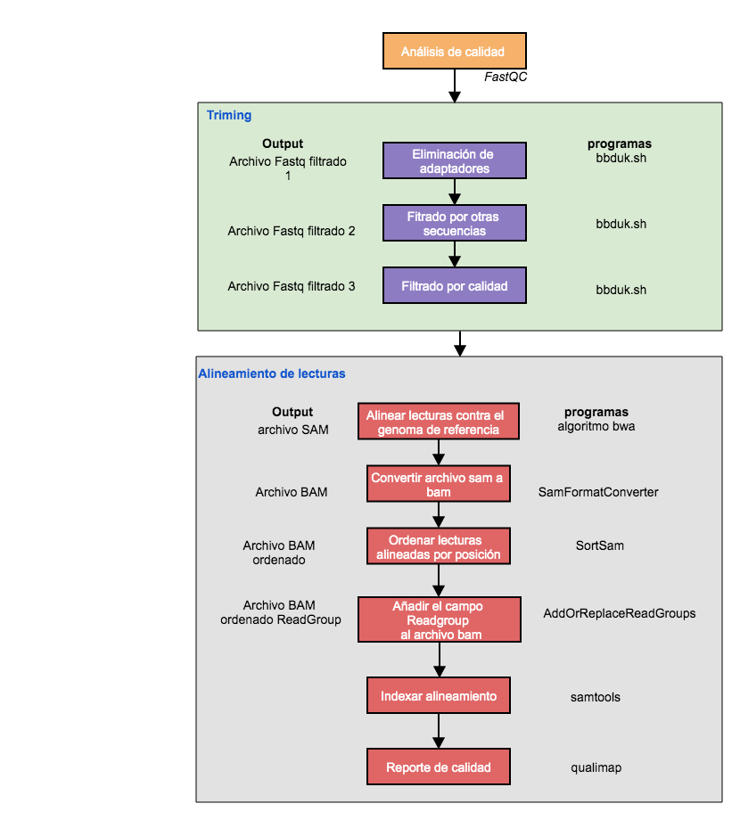

# Tutorial para el filtro y alineamiento de lecturas

Karen Oróstica, Cristian Yáñez Lara y Ricardo Verdugo
Creado abril 2020, actualizado viembre 2025

En este tutorial presentamos los pasos necesarios para realizar el filtrado y alineamiento de secuencias. En la siguiente imagen les mostramos
el pipeline a seguir en este tutorial. El análisis de calidad fue realizado en el la clase anterior.

 

El siguiente protocolo está diseñado para ser implementado en el servidor genoma.med.uchile.cl dentro de la carpeta de cada usuario de bioinfo1.

## Conectarse al servidor

```sh
ssh -Y bioinfo1@genoma.med.uchile.cl
```

Usar la clave entregada en clase.

## Acceda al directorio con su nombre:

Ejemplo:

```sh
cd jperez/
```

El alumno debe usar su propio directorio.

## Software requerido

### 1. BBDuk

Descontaminación con Kmers. Herramienta de poda (trimming), filtrado y enmascaramiento de secuencias basada en Kmer que combina las operaciones más comunes relacionadas con la calidad de los datos en una sola pasada: recorte de calidad, eliminación de adaptadores, filtrado de contaminantes, enmascaramiento de secuencias, filtrado de GC, filtrado de longitud, filtrado de entropía, conversión de formato, generación de histogramas y varias otras operaciones [BBDuk](https://bbmap.org/tools/bbduk).

Sintaxis de uso (ejemplos más adelante):

```
bbduk.sh in=<input file> out=<output file> ref=<contaminant files>
```

### 2. BWA

BWA es un paquete de programas para mapear secuencias de ADN contra un gran 
genoma de referencia. Consta de tres algoritmos: 

* BWA-backtrack: diseñado para lecturas de secuencias de Illumina de hasta 100 pb

* BWA-SW: para secuencias más largas oscilaron entre 70 pb y unas pocas
   megabases. 

* BWA-MEM: para secuencias más largas oscilaron entre 70 pb y unas pocas
   megabases, pero es más rápido y preciso. También tiene un mejor rendimiento que BWA-backtrack para 
  lecturas de Illumina de 70-100 pb.

Para más información y para obtener es software: [GitHub - lh3/bwa](https://github.com/lh3/bwa). El manual de uso puede verse [online](https://bio-bwa.sourceforge.net/bwa.shtml).

Sintaxis de uso (ejemplos más adelante):

```
bwa index ref.fa

bwa mem ref.fa reads.fq > aln-se.sam

bwa mem ref.fa read1.fq read2.fq > aln-pe.sam

bwa aln ref.fa short_read.fq > aln_sa.sai

bwa samse ref.fa aln_sa.sai short_read.fq > aln-se.sam

bwa sampe ref.fa aln_sa1.sai aln_sa2.sai read1.fq read2.fq > aln-pe.sam

bwa bwasw ref.fa long_read.fq > aln.sam 
```

### 3. Picard

Picard es un paquete de programas escritos en lenguaje Java que permiten realizar numerosas tareas. Para ver la lista completa de programas, eecute este comando en el cluster genoma (no es necesario cargar un módulo para utilizar este programa):

```
java -jar /opt/picard/picard-2.25.2/picard.jar
```

O revise la [documentación en línea](https://broadinstitute.github.io/picard/). 

El modo de uso es:

```
USAGE: PicardCommandLine <program name> -h
```

### 4. SAMTOOLS

Samtools es un conjunto de programas para interactuar con datos de secuenciación masiva. Consta de tres repositorios distintos:

* Samtools Lectura/escritura/edición/indexación/visualización del formato SAM/BAM/CRAM
* BCFtools Lectura/escritura de archivos BCF2/VCF/gVCF y llamado/filtrado/resumen de SNP y variantes de secuencia indels cortos
* HTSlib Una biblioteca C para leer/escribir datos de secuenciación de alto rendimiento
  Samtools y BCFtools usan HTSlib internamente, pero estos paquetes fuente contienen sus propias copias de htslib para que puedan construirse de forma independiente.

Para mayor información, ver la [documentación online](https://www.htslib.org/).

### 5. Qualimap

Es una aplicación escrita en Java y R que proporciona una interfaz gráfica de usuario (GUI) y una interfaz de línea de comandos para facilitar el control de calidad de los datos de secuenciación de alineación y sus derivados.

Para mayor información, ver la [documentación online](http://qualimap.conesalab.org/).

## Flujo de trabajo

## 1. Filtrado de lecturas

Las lecturas crudas pueden contener secuencias de adaptadores usados en la secuenciación, contaminantes y sitios con bajas calidades. Comúnmente en las técnicas NGS el extremo 3' posee una menor calidad que el extremo 5'. El procesamiento de las lecturas para eliminar las secuencias pertenecientes a adaptadores y los pares de bases con baja calidad se denomina Trimming. Para realizar un trimming adecuado de lecturas se debe hacer un análisis previo de la calidad de la secuenciación mediante el programa FastQC. Una vez realizado este análisis se realiza un trimming de lecturas usando el programa bbduk en 3 pasos:

## 1.1 Eliminación de adaptadores

Para usar en el cluster genoma:

```
module load BBMap
```

Comando:

```sh
bbduk.sh -Xmx2g threads=1 \
in1=muestra_R1_001.fastq.gz \
in2=muestra_R2_001.fastq.gz \
out1=muestra_R1_filter1.fastq.gz \
out2=muestra_R2_filter1.fastq.gz \
ref=adapters.fa tpe tbo
```

Ejemplo:

```sh
bbduk.sh -Xmx2g threads=1 \
in1=~/181004_curso_calidad_datos_NGS/fastq_raw/S10_R1.fastq.gz \
in2=~/181004_curso_calidad_datos_NGS/fastq_raw/S10_R2.fastq.gz \
out1=S10_R1_filter1.fastq.gz \
out2=S10_R2_filter1.fastq.gz \
ref=~/resources/bbmap/adapters.fa tpe tbo
```

La entrada in1, in2 son las lecturas crudas. Esto crea dos archivos con el sufijo "filter1.fastq.gz" correspondiente a las lecturas pareadas donde se eliminan la secuencia de adaptadores y contaminantes que alinean con las secuencias del archivo fasta "adapters.fa".

## 1.2 Eliminación de lecturas que contengan secuencia del fago phix

Comando:

```sh
bbduk.sh -Xmx2g threads=1 \
in1=muestra_R1_filter1.fastq.gz \
in2=muestra_R2_filter1.fastq.gz \
out1=muestra_R1_filter2.fastq.gz \
out2=muestra_R2_filter2.fastq.gz \
ref=phix174_ill.ref.fa.gz
```

Ejemplo:

```sh
bbduk.sh -Xmx2g threads=1 \
in1=S10_R1_filter1.fastq.gz \
in2=S10_R2_filter1.fastq.gz \
out1=S10_R1_filter2.fastq.gz \
out2=S10_R2_filter2.fastq.gz \
ref=~/resources/bbmap/phix174_ill.ref.fa.gz
```

La entrada (in1, in2) son las lecturas filtradas en el paso anterior. Esto crea un 2 archivos "filter2.fastq.gz" correspondiente a las lecturas pareadas donde se eliminan la secuencia del fago phix que alinean con las secuencias del archivo fasta "phix174_ill.ref.fa.gz".

## 1.3 Filtrado por calidad de las lecturas

Comando:

```sh
bbduk.sh -Xmx2g threads=1 \
in1=muestra_R1_filter2.fastq.gz \
in2=muestra_R2_filter2.fastq.gz \
out1=muestra_R1_filter3.fastq.gz \
out2=muestra_R1_filter3.fastq.gz \
qtrim=w trimq=20 minlength=30 minavgquality=20
```

Ejemplo:

```sh
bbduk.sh -Xmx2g threads=1 \
in1=S10_R1_filter2.fastq.gz \
in2=S10_R2_filter2.fastq.gz \
out1=S10_R1_filter3.fastq.gz \
out2=S10_R2_filter3.fastq.gz \
qtrim=w trimq=20 minlength=30 minavgquality=20
```

La entrada (in1, in2) son las lecturas filtradas en el paso anterior. Estas lecturas son filtradas por calidad usando una ventana deslizante con el parámetro "qtrim=w", que elimina la región de la lectura con una calidad menor a 20 en adelante "trimq=20" (hacia el extremo 3'), luego evalúa el largo resultante de la lectura, eliminandola si es menor a 30 pb "minlength=30". Como último filtro, elimina la lectura si el promedio de calidad total es <= 20 "minavgquality=20". De esta forma se obtienen las lecturas filtradas ("filter3"). Estos parámetros fueron establecidos como óptimos al analizar las lecturas crudas con el programa FastQC, pero pueden ser modificados acorde a la calidad de los datos.

## 2. Alineamiento de lecturas

## 2.1 Alinear lecturas contra el genoma de referencia

Se alinean las lecturas contra el genoma de referencia, obteniéndose un archivo SAM (Sequence alignment map).

Para usar en el cluster genoma:

```
module load bwa
```

Comando:

```sh
bwa mem -t 4 -M reference.fasta \
muestra_R1.fastq.gz \
muestra_R2.fastq.gz \
> muestra.sam
```

Ejemplo:

```sh
bwa mem -t 4 -M /datos/reference/genomes/hg19_reference/hg19.fasta \
S10_R1_filter3.fastq.gz \
S10_R2_filter3.fastq.gz \
> S10.sam
```

Nota 1: Revise la [documentación de bwa](http://manpages.org/bwa) e inspeccione las distintas opciones que entrega bwa y los atributos que puede modificar.

El siguiente conjunto de operaciones de preprocesamiento formatea los datos para adaptarse a los requisitos de las herramientas GATK convirtiendo los datos de asignación en un archivo BAM ordenado por posición, con el campo "Read Group" añadido.

## 2.2 Convertir archivo sam a bam (binario)

Se obtiene un bam (binary alignment map) a partir del alineamiento en formato sam.

Comando:

```sh
java -jar picard.jar SamFormatConverter \
I=muestra.sam \
O=muestra.bam
```

Ejemplo:

```sh
java -jar /opt/picard/picard-2.25.2/picard.jar SamFormatConverter -I S10.sam -O S10.bam
```

## 2.3 Ordenar lecturas alineadas por posición

Obtenemos un archivo bam con las lecturas ordenadas por posición del alineamiento a la referencia.

Comando:

```sh
java -jar picard.jar SortSam \
I=muestra.bam \
O=muestra_sorted.bam \
SO=coordinate
```

Ejemplo:

```sh
java -jar /opt/picard/picard-2.25.2/picard.jar SortSam -I S10.bam -O S10_sorted.bam -SO=coordinate
```

## 2.4 Añadir el campo Readgroup al archivo bam

Comando:

```sh
java -jar picard.jar AddOrReplaceReadGroups \
I=muestra_sorted.bam \
O=muestra_sorted_RG.bam \
ID=muestra LB=Paired-end PL=Illumina PU=Unknown SM=muestra
```

Ejemplo:

```sh
java -jar /opt/picard/picard-2.25.2/picard.jar AddOrReplaceReadGroups -I S10_sorted.bam -O S10_sorted_RG.bam -ID sample -LB Paired-end -PL Illumina -PU Unknown -SM sample
```

## 2.5 Indexar alineamiento

Cargar el módulo si está usando el cluster genoma:

```
module load samtools
```

Comando:

```sh
samtools index muestra_sorted_RG.bam
```

Ejemplo:

```sh
samtools index S10_sorted_RG.bam
```

¿Qué archivo se creó?

## 2.6 Generar un reporte de calidad

Qualimap es una aplicación escrita en Java y R que posee una interfaz gráfica de usuario (GUI) y una interfaz de línea de comandos para facilitar el control de calidad de los datos de alineamiento de secuencias.
Este programa proporciona una vista general de los datos que ayuda a detectar sesgos en la secuenciación y / o mapeo de los datos y facilita la toma de decisiones para un análisis posterior.

Cargar el módulo si está usando el cluster genoma:

```
module load qualimap
```

Comando:

```sh
qualimap bamqc -bam muestra_sorted_RG.bam -gff regiones_blanco.bed
```

Ejemplo:

```sh
qualimap bamqc -bam S10_sorted_RG.bam -gff ~/181004_curso_calidad_datos_NGS/regiones_blanco.bed -outdir ./S10_sorted_RG
```

## 3 Tarea

1) Realizar el alineamiento contra el genoma humano hg19 de las lecturas R1 y R2 del paciente seleccionado para la tarea de control de calidad de lecturas de secuencia.
2) Utilizando una línea de comando, encuentre la primera lectura en el archivo SAM que contenga bases enmascaradas (secuencias suavizadas por soft-clipping)
3) Muestre el registros de la lecturas en el archivo SAM e identifique y explique el código CIGAR de esa lectura.
4) Generar un reporte técnico de calidad del alineamiento con *qualimap*.
5) Seleccionar 4 figuras que a su juicio sean las más informativas sobre la calidad de los datos y del ensamble.
6) Incluir las figuras en la sección de Resultados de un reporte técnico. Describir cada figura con una leyenda descriptiva. Adicionalmente, en el texto de la sección, interpretar los resultados y citar cada figura. Debe referirse a la calidad de los datos y del alineamiento. Enfóquese especialmente en los posibles problemas con los datos o alineamientos. Comente potenciales razones que expliquen lo observado. Incluya una sección con las principales *Conclusiones* para la muestra.
7) Incluya el reporte completo generado con *qualimap* como anexo.
8) Comparta el informe en formato markdown a través de github para dar por completada esta tarea.

## Anexo

Los pasos descritos en este anexo son necesarios previo a la ejecución de los procedimiento descritos en el tutorial y ya fueron realizados para facilitar su desarrollo en nuestro servidor. Si usted realiza estos análisis en otro servidor, necesitará realizar estos pasos previamente.

## 1. Preparar la referencia

El genoma humano de la referencia usado para el procesamiento de las lecturas es hg19. Para usar este genoma en formato fasta se debe procesar para generar distintos archivos necesarios para el flujo de trabajo.

### Procesamiento 1 (necesario para usar el programa BWA):

Comando:

```sh
bwa index -a bwtsw reference.fasta
```

### Procesamiento 2 (necesario para usar el programa BWA):

Comando:

```sh
samtools faidx reference.fasta
```

Procesamiento 3 (necesario para usar el programa GATK):

Comando:

```sh
java -jar picard.jar CreateSequenceDictionary REFERENCE=reference.fasta OUTPUT=reference.dict
```

Nota 1: La preparación de la referencia se debe realizar solo una vez, para efectos prácticos del curso la referencia ya se encuentra procesada con los comandos descritos.
