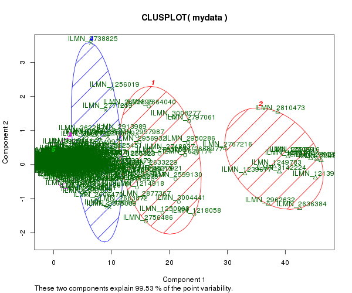
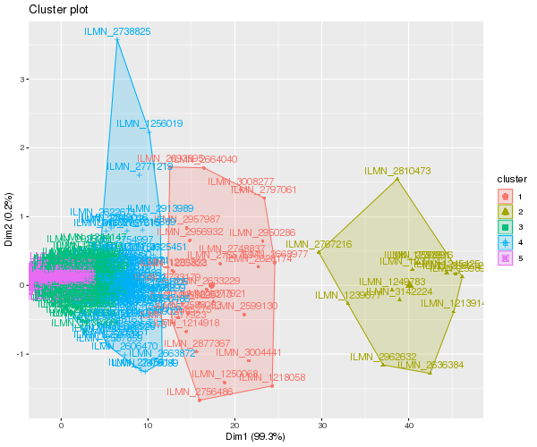
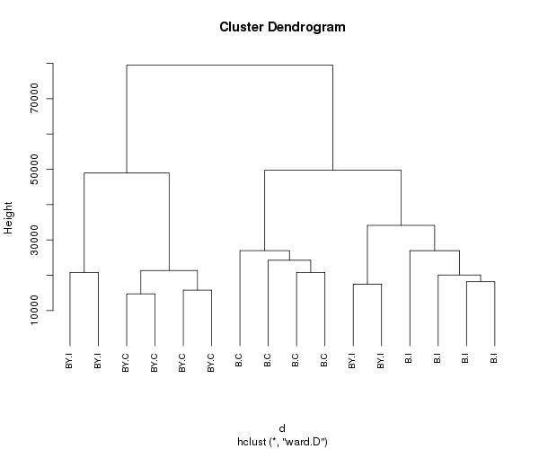
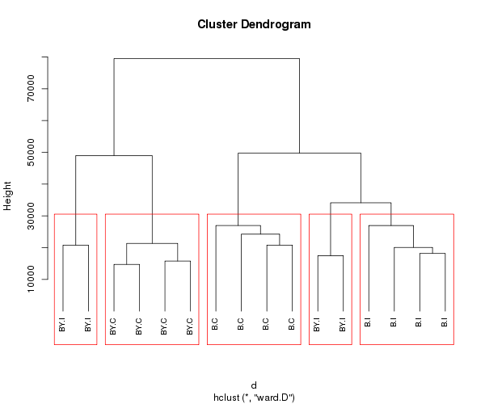

# Analisis funcional de datos de microarreglos

Ricardo Verdugo y Karen Oróstica

## Datos

Para este tutorial, utilizaremos la matriz datos normalizados que generamos en el tutorial Análisis de expresión diferencial en R

En el tutorial pasado, generamos un objeto normdata. Vaya la carpeta DE_tutorial, vuelva a importar los datos y normalizarlos. Una vez generada la matrix de datos, expórtela como un archivo plano separado por tabulaciones.

```R
outdir     <- "output"

if(!file.exists(outdir)) {
  dir.create(outdir, mode = "0755", recursive=T)
 }

Data.Raw  <- read.delim("Illum_data_sample.txt")
signal    <- grep("AVG_Signal", colnames(Data.Raw)) # vector de columnas con datos 
detection <- grep("Detection.Pval", colnames(Data.Raw))

annot     <- read.delim("MouseRef-8_annot.txt")
probe_qc  <- ifelse(annot$ProbeQuality %in% c("Bad", "No match"), "Bad probes",
  "Good probes")

design    <- read.csv("YChrom_design.csv")
print(design)

Data.Raw <- Data.Raw[probe_qc %in% "Good probes",]
annot    <- annot[probe_qc %in% "Good probes",]

rawdata           <- as.matrix(Data.Raw[,signal])
rownames(rawdata) <- Data.Raw$PROBE_ID
colnames(rawdata) <- design$Sample_Name

library(preprocessCore)
normdata           <- normalize.quantiles(rawdata) 
colnames(normdata) <- colnames(rawdata)
rownames(normdata) <- rownames(rawdata)

probe_present      <- Data.Raw[,detection] < 0.04
detected_per_group <- t(apply(probe_present, 1, tapply, design$Group, sum))

present  <- apply(detected_per_group >= 2, 1, any)
normdata <- normdata[present,]
annot    <- annot[present, ]

write.table(normdata, file.path(outdir, "normdata.txt"), sep="\t", row.names=T)
```

Luego cree una nueva carpeta para este tutorial e inicie una sesión de R usado esa capeta como directorio de trabajo.

## Tutorial
Este tutorial está basado en el [Cluster Analysis, Quick-R, DataCamp](https://www.statmethods.net/advstats/cluster.html).

### Importe los datos
```R
mydata <- read.delim("../output/normdata.txt", as.is=T)
```
Cambie los nombres de las columnas para que sea más fácil identificar el grupo experimental en los siguientes gráficos.

```R
design <- read.csv("../YChrom_design.csv")
colnames(mydata) <- design$Group
```

### Preparar los datos
```R
mydata <- na.omit(mydata) # eliminación filas con faltantes
mydata <- scale(mydata) # estandarizar variables
```

## Particionamiento (Clustering)

K-means clustering es el método de partición más popular. Requiere que el analista especifique la cantidad de clusters que desea extraer. Una gráfica de la suma de cuadrados dentro de los grupos por número de grupos extraídos puede ayudar a determinar el número apropiado de grupos. El analista busca una curva en la gráfica similar a una prueba de evaluación en el análisis factorial. Ver Everitt y Hothorn (pág. 251). Es decir, queremos el menor k que maxima la disminución de la suma de cuadrados. Una vez que la suma de cuadrados se estabiliza, no hay beneficio en seguir aumentado el k.

```R
# Determinar el número de grupos
wss <- (nrow(mydata)-1)*sum(apply(mydata,2,var))
for (i in 2:15) wss[i] <- sum(kmeans(mydata,
   centers=i)$withinss)

png("SSQ_by_K_using_kmeans.png", width=600, heigh=500)
  plot(1:15, wss, type="b", xlab="Number of Clusters",
    ylab="Within groups sum of squares") 
dev.off()

```


En base a este gráfico, un K=5 parece un número razonable de clusters, así que usaremos ese valor.

```R
fit <- kmeans(mydata, 5) # 5 cluster solution
class(fit)
# [1] "kmeans"

# append cluster assignment
mydata2 <- data.frame(mydata, fit$cluster) 
head(mydata2)
                    B.I      BY.I       B.C       BY.C      B.C.1      B.I.1
ILMN_1248788   207.3817  250.1129  221.9986   252.7182   246.3669   201.0584
ILMN_2896528 10069.3537 9936.6241 9839.0757 12435.8400 11339.6023 10165.8597
ILMN_2721178  2146.1743 2037.4831 2084.2946  2705.3736  2556.7989  2216.5564
ILMN_1227723  1138.9989 1089.6837  927.3898   927.3898  1274.3487  1081.4380
ILMN_3033922  1855.7668 1797.0263 1855.7668  1799.6424  2099.7710  1891.1571
ILMN_3092673  8047.4719 7507.8776 7601.7383  7321.8261  8452.9129  8237.6955
                BY.I.1     BY.C.1     BY.C.2      B.C.2     BY.I.2     B.I.2
ILMN_1248788  267.1375   214.2343   199.2973   219.7224   236.7965  194.6496
ILMN_2896528 8948.2579 12255.4739 11542.1811 10615.6144 10615.6144 9511.4862
ILMN_2721178 2155.8708  2497.0567  2713.5130  2166.2265  2072.5239 2022.4722
ILMN_1227723 1151.0470   924.1201  1107.6753  1202.7625  1136.6648 1050.2442
ILMN_3033922 1771.0536  1870.0569  1791.2293  1911.4861  1722.9694 1836.4394
ILMN_3092673 6723.2857  7943.6365  8237.6955  8452.9129  7601.7383 8150.2006
                  B.I.3     BY.I.3     BY.C.3     B.C.3 fit.cluster
ILMN_1248788   211.8343   207.8115   221.9986  171.3909           4
ILMN_2896528 10028.7244 10885.4851 12435.8400 9029.3847           2
ILMN_2721178  2078.4187  2354.4808  2724.6773 2376.6771           1
ILMN_1227723  1172.4656  1149.4365   976.4341 1114.9443           4
ILMN_3033922  1891.1571  1859.8280  1949.1789 1739.1569           4
ILMN_3092673  7479.2309  8047.4719  8237.6955 7479.2309           2
```

### Calcule los promedios de expresión por cluster
```R
aggregate(mydata,by=list(fit$cluster),FUN=mean)

  Group.1       B.I       BY.I        B.C       BY.C        B.C        B.I
1       1 52412.040 52412.0399 52412.0399 52412.0399 52412.0399 52412.0399
2       2  3732.378  3733.8785  3725.5083  3727.6995  3723.2772  3730.3724
3       3 23674.468 23774.2967 23506.7469 23412.2511 23435.3683 23368.0363
4       4 10291.461 10256.0496 10344.5888 10355.3966 10336.0652 10399.2822
5       5   528.928   528.7892   529.9703   530.5617   531.2235   528.7974
        BY.I       BY.C       BY.C       B.C       BY.I        B.I       B.I
1 52412.0399 52412.0399 52412.0399 52412.040 52077.8121 52077.8121 52412.040
2  3735.4716  3732.0670  3726.4979  3723.584  3731.5504  3739.0103  3736.976
3 23716.5112 23451.7654 23647.4590 23725.561 23951.5896 23516.6848 23774.297
4 10250.9351 10337.8046 10296.6688 10268.616 10226.1668 10345.5624 10242.462
5   529.3597   530.1607   530.0147   530.410   530.3385   530.0446   528.868
       BY.I       BY.C       B.C
1 51966.727 52412.0399 52412.040
2  3731.080  3729.4663  3724.861
3 23836.102 23673.2230 23735.708
4 10278.669 10282.1466 10272.214
5   530.441   529.8188   529.758
```


### Gráfico de clústers contra los 2 primeros componentes principales de varianza

```R
library(cluster)

png("Clusplot_kmeans_k5.png", width=600, heigh=500)
  clusplot(mydata, fit$cluster, color=TRUE, shade=TRUE,
   labels=2, lines=0)
dev.off()
```


Utilizar la librería factoextra que genera gráficcos basados en ggplot. La función fviz_cluster() genera gráficos para métodos basados en particionamiento, incluyendo kmeans, pam, Mclust, entre otros. 

```R
library(factoextra)
png("fviz_cluster_kmeans_k5.png", width=600, heigh=500)
  fviz_cluster(fit, data = mydata)
dev.off()
```


Se puede invocar una versión robusta de K-means basada en mediods usando pam () en lugar de kmeans(). La función pamk() en el paquete fpc es una envoltura para pam que también imprime el número sugerido de grupos en función del ancho de silueta promedio óptimo.


## Clúster jerárquico
Hay una amplia gama de enfoques de agrupamiento jerárquico. He tenido buena suerte con el método de Ward que se describe a continuación.

```R
d <- dist(t(mydata), method = "euclidean") # distance matrix
fit <- hclust(d, method="ward.D")
png("hclust_samples.png", width=600, heigh=500)
  plot(fit, hang = -1, cex = 0.8) # display dendogram
dev.off()
```


Visualice los groups

```R
groups <- cutree(fit, k=5) # cut tree into 5 clusters
groups
# B.I BY.I  B.C BY.C  B.C  B.I BY.I BY.C BY.C  B.C BY.I  B.I  B.I BY.I BY.C  B.C
#   1    2    3    4    3    1    2    4    4    3    5    1    1    5    4    3
```

Dibuje cuadrados al rededor de los clusters cuando el arbol se corta para generar 5 clusters
```R
png("rect_hclust_samples.png", width=600, heigh=500)
  plot(fit, hang = -1, cex = 0.8) # display dendogram
  rect.hclust(fit, k=5, border="red") 
dev.off()
```


### Clústering jerárquico de genes
Usaremos la función get_dist() del paquete factoextra, que a diferencia de la función dist(), puede calcular distancias en base a la correlación de pearson. Esta medida es preferible cuando no nos interesa agrupar genes por su nivel promedio de expresión, sino por su patrón de expresión.

```R
gd <- get_dist(mydata, method ="pearson", stand=FALSE)
gfit <- hclust(gd, method="ward.D")
png("hclust_genes.png", width=600, heigh=500)
  plot(gfit, hang = -1, cex = 0.8, labels = FALSE) # display dendogram
dev.off()
```


## Tarea

Usando solo los genes seleccionados por expresión diferencial obtenidos en el tutorial de expresión diferencial, ya sea por tratamiento, genotipo o por interacción:

* Realice un particionamiento jerárquico de sus muestras con la medida de distancia euclideana
* Realice un particionamiento jerárquico de sus sondas usando el complemento de la correlación de pearson como la medida de distancia.
* Genere gráficos de suma de cuadrados para sondas y para muestras
* Basándose en los gráficos de sumas de cuadrados, elija el k más apropiado en su criterio para sondas y para muestras
* Agregue rectángulos a los particionamiento jerárquicos (nota, en su informe puede mostrar solo el arbolo final, con los rectángulos).
* Guarde su trabajo como un informe en formato pdf.

