# Métodos de representación reducida de genomas (GSBS, RADseq y amigos)

#### Alicia Mastretta Yanes

## Metodologías de representación reducida de genomas (RAD, GBS, etc)

Las metodologías de representación reducida de genomas consisten en secuenciar una fracción del genoma en vez del genoma completo. 

Esto se logra a partir de digerir los genomas con **enzimas de restricción** y luego secuenciar los fragmentos.

El primer método de representación reducida de genomas fue la secuenciación Asociada a sitios de restricción (RADseq) de Baird y colaboradores.

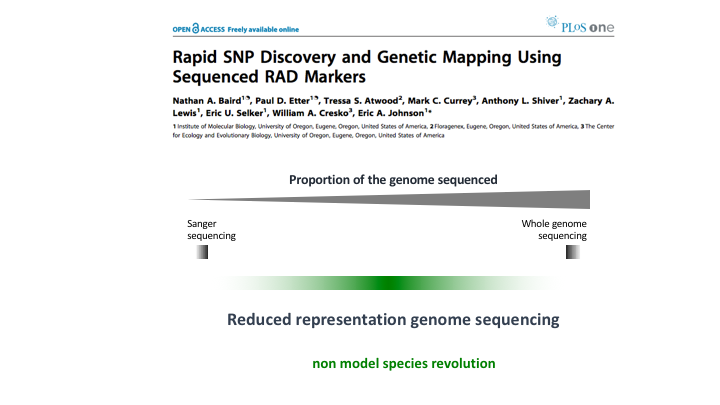

Posteriormente Peterson et al (2012) desarrollaron el método ddRAD, digiriendo con dos enzimas de restricción.

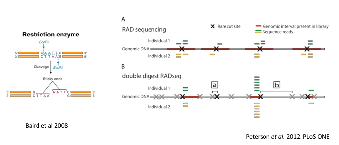

Hoy existen muchos métodos distintos con pequelas variaciones. Los comentaremos brevemente, pero la revisión de Andrews et al (2016) es la mejor forma de concer y entender sus diferencias.

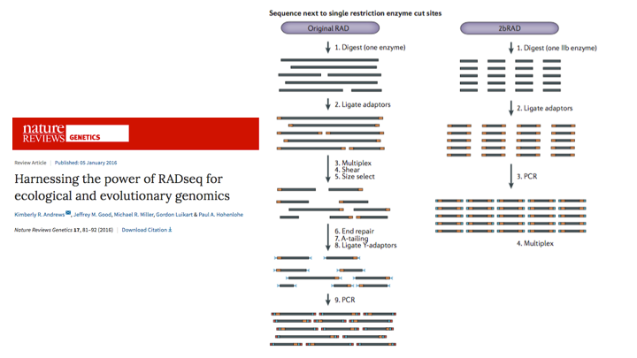

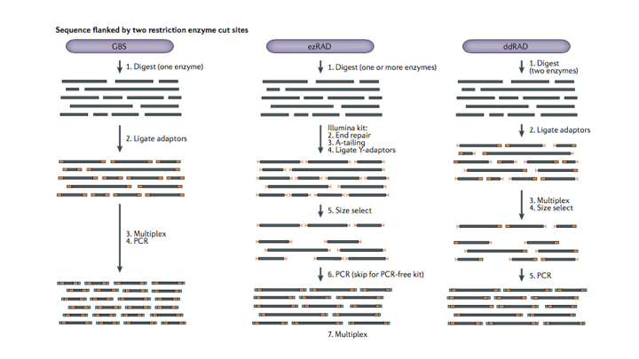

Para entender sus diferencias es importante entender qué son los **adaptadores**, cómo se pegan al DNA objetivo y dónde y cuántos **barcodes** se ponen a las muestras.

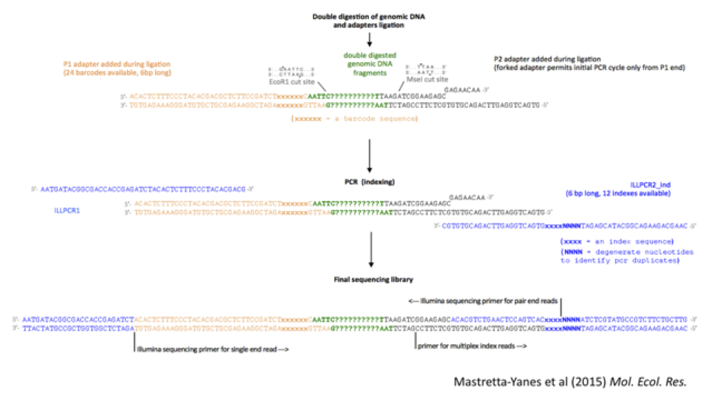

## Ensamblaje de novo vs. sobre una referencia

Los método de representación reducida de genoma generan los mismos **fragmentos de DNA** a lo largo del genoma de varios individuos distintos de la misma especie, o de especies cercanas.

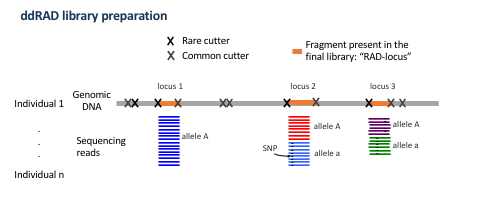

Para convertirlos en **genotipos** (loci con diferentes alelos en uno o más individuos) existen dos alternativas:

* Mapeo contra genoma de referencia + llamado de SNPs

* Ensamble *de novo* + llamado de SNPs

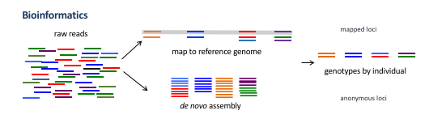

El mapeo contra genoma de referencia se hace **por muestra (individuo)** igual que cuando mapeamos un genoma completo. Por ejemplo usando BWA como vimos en [tuturiales pasados](https://github.com/u-genoma/BioinfinvRepro/blob/master/Unidad6/Tutorial_filtro_alineamiento_lecturas_chilegenomicolab.md) de este curso. 

El ensamblado de novo es más complicado y requiere ajustar varios **parámetros de ensamblado de novo**.

* Son varios y qué valor les demos *cambia el resultado*
* Los parámetros óptimos **varian dependiendo del set de datos** (taxa, calidad de los reads, profundidad, etc)
* No son los mismos entre pogramas

*In general terms, these parameters should be relaxed enough to account for genetic variation and sequencing errors, but strict enough to discriminate between paralogous loci.*

Rochette & Catchen et al (2017) Nature Protocols

Los parámetros más sensibles son la covertura (número de reads por locus):

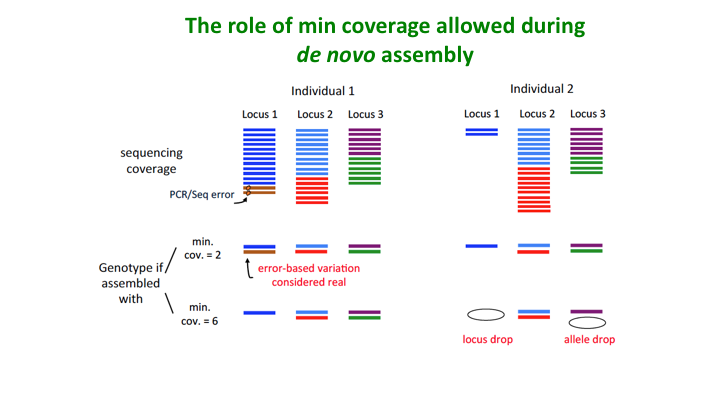

Y el nivel de disimilitud entre secuencias para que las consideremos diferentes alelos de un mismo locus:

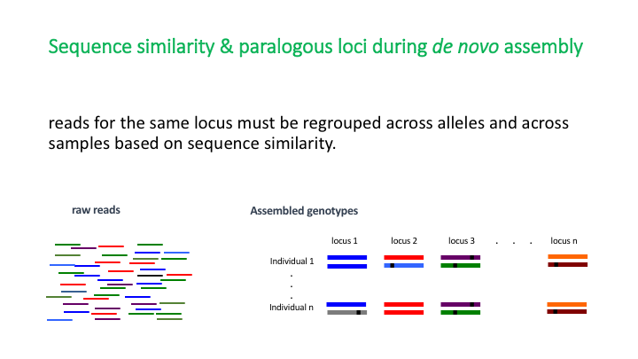

Lo cual hace que los parálogos sean una posible pesadilla. 

Recordamos qué son los loci parálogos:

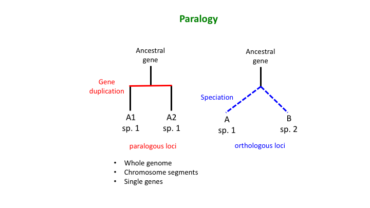

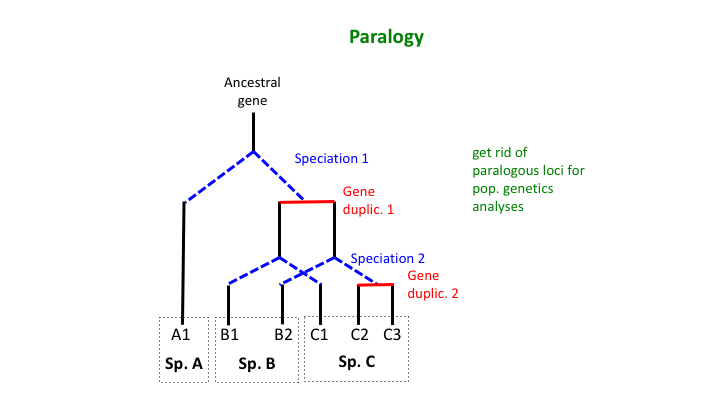

Por qué son un problema:

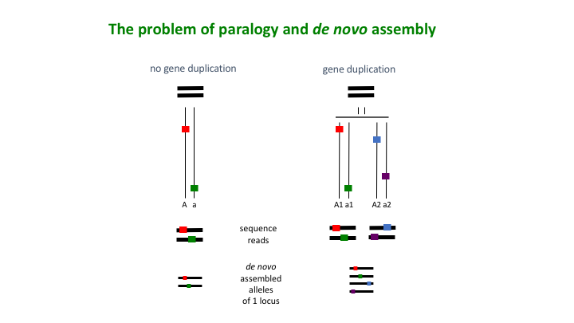 

(pero a veces las pesadillas traen recompensas, como veremos al final)

## Principales algoritmos y software (Stacks, pyRAD, Tassel)

Hay varios programas para trabajar con datos reducidos de genomas. Cuál usar depende del método de laboratorio y enfoque que daremos a los análisis:

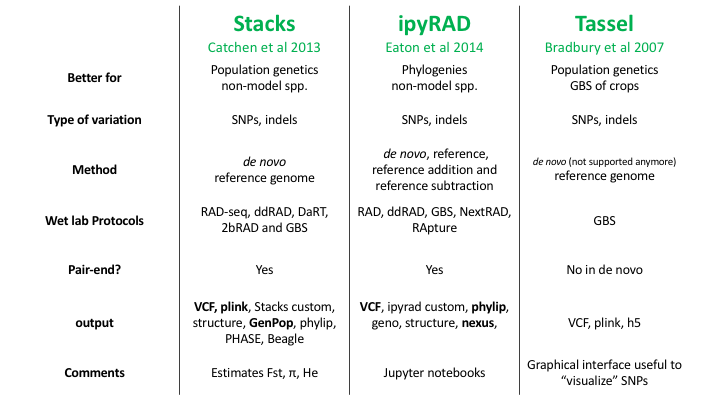

### Stacks
[Webpage](http://catchenlab.life.illinois.edu/stacks/)

[Manual](http://catchenlab.life.illinois.edu/stacks/manual/)

[Main parameters](http://catchenlab.life.illinois.edu/stacks/param_tut.php)

Pipeline:

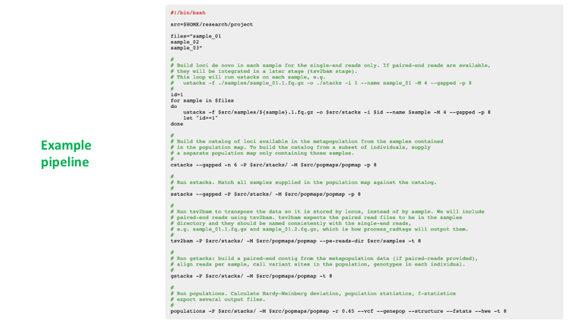

(código de la pipeline en punto 4.4 del [manual](http://catchenlab.life.illinois.edu/stacks/manual/) )

#### Tutorial Stacks

En este artículo (pdf en el google classroom) se describe un protocolo paso por paso de cómo correr stacks con datos ejemplos:

Rochette, N. C. & Catchen, J. M. Deriving genotypes from RAD-seq short-read data using Stacks. Nature Protocols 12, 2640–2659 (2017).

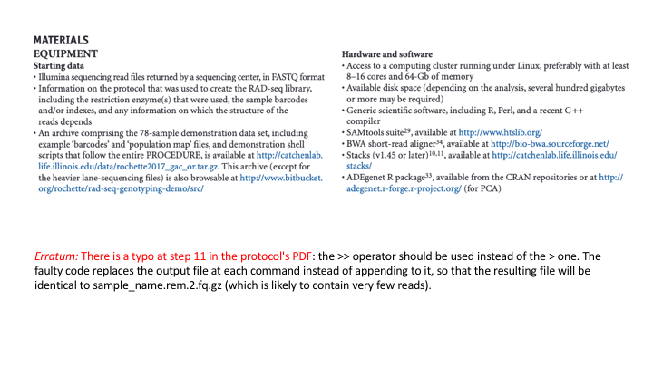

[Demo scripts](https://bitbucket.org/rochette/rad-seq-genotyping-demo/src/default/)

[Demo data](http://catchenlab.life.illinois.edu/data/rochette2017_gac_or.tar.gz)

### ipyrad

[Webpage](https://ipyrad.readthedocs.io/en/latest/1-ethos.html)

[Manual](https://ipyrad.readthedocs.io/en/latest/index.html)

[Main parameters](https://ipyrad.readthedocs.io/en/latest/6-params.html)

Pipeline:

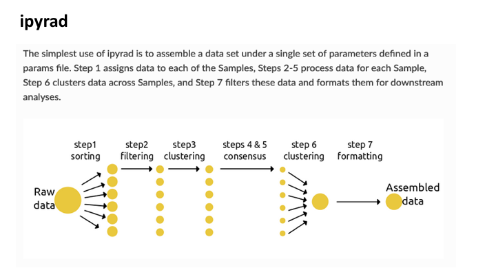
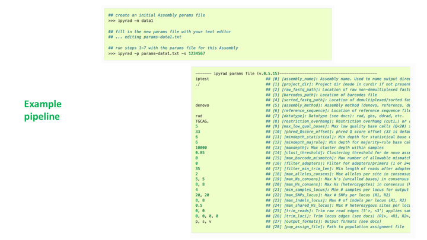

#### Tutorial ipyrad
[Tutorial introductorio](https://ipyrad.readthedocs.io/en/latest/tutorial_intro_cli.html)

[Tutorial avanzado](https://ipyrad.readthedocs.io/en/latest/tutorial_advanced_cli.html)


[Tutorial Análisis POST ensamble](https://ipyrad.readthedocs.io/en/latest/API-analysis/index.html)

El tutorial anterior viene con un [link de binder](https://mybinder.org/v2/gh/dereneaton/ipyrad/master?filepath=newdocs%2FAPI-analysis) donde puedes ver los análisis en tu explorador sin instalar nada. 

### Tassel
* [Webpage](https://www.maizegenetics.net/tassel)
* [Manual](https://bitbucket.org/tasseladmin/tassel-5-source/wiki/UserManual)
* [Rtassel (conection to R!)](https://bitbucket.org/bucklerlab/rtassel/wiki/Home)

Pipeline:

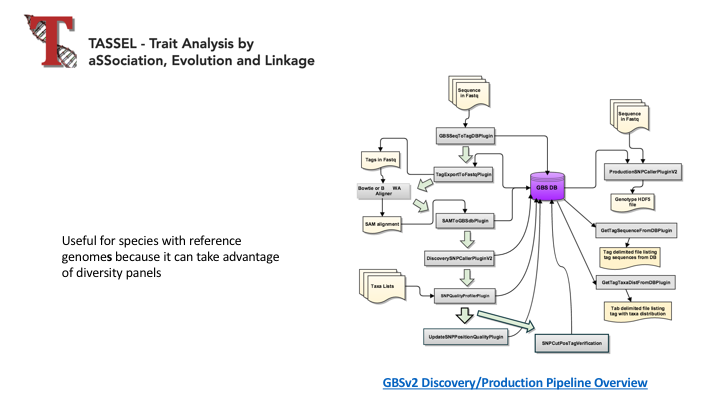

Interfaz amigable para ver genotipos:

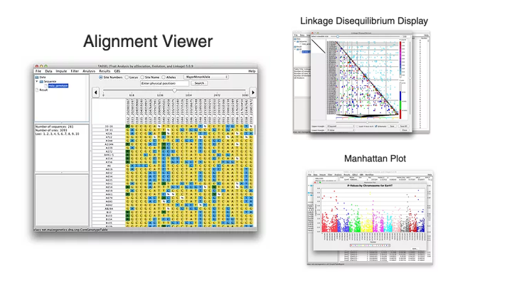

## Optimizar el ensamblaje novo 

La información de un set de datos RADseq/GBS etc varía dependiendo de los parámetros de ensamblado de novo, como describimos en el artículo:

Mastretta-Yanes, A., Arrigo, N., Alvarez, N., Jorgensen, T. H., Piñero, D., & Emerson, B. C. (2015). Restriction site-associated DNA sequencing, genotyping error estimation and de novo assembly optimization for population genetic inference. Molecular Ecology Resources, 15(1), 28–41. doi: 10.1111/1755-0998.12291


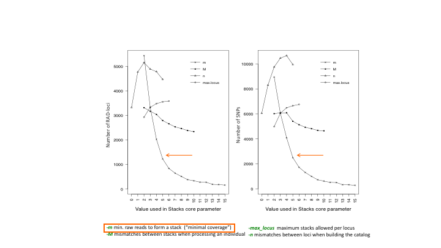

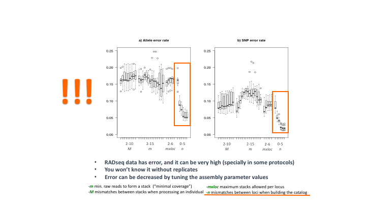

Los parámetros óptimos dependen de:

* Polimorfismo del genoma
* Error se secuenciación y calidad de las secuencias
* Profundidad de secuenciación

Por lo tanto los parámetros **default** del programa **no** son los mejores para **mis datos**.

Oh shit. 

¿Qué parámetros escojo? ¿Con qué loci me quedo?

Solución:

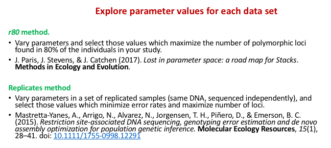

Sí vale la pena:

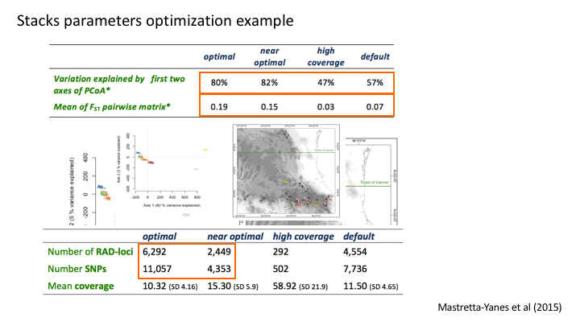

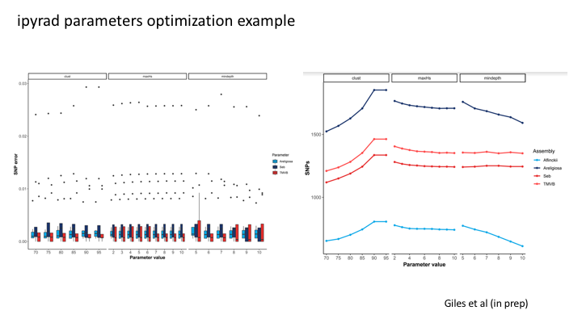

## Primera inspección de los datos

Gráficas básicas de tus datos te pueden decir mucho sobre su calidad y qué decisiones tomar durante el proceso de análisis. 

Por ejemplo:

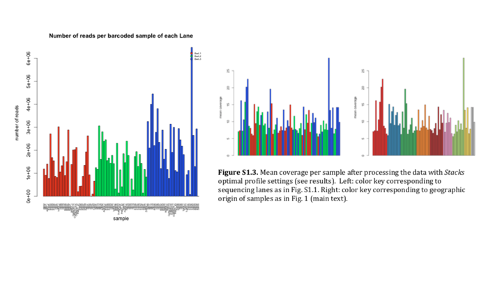

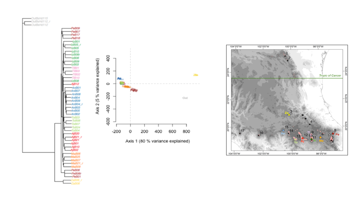

## Recomendaciones

#### Continua filtrando

Una vez que tengas un ensamblado base, puedes seguir filtrando por:

* MAF 
* Missing data a nivel loci
* Missing data a nivel individuos (a veces es mejor descartar un individuo con mucho missing data)

Para esto son útiles VCFtools y plink. Recuerden vimos [vcf y plink de unidades pasadas](https://github.com/u-genoma/BioinfinvRepro/blob/master/Unidad5/Unidad5-Pop_genetics_software_especializado.md) (ejemplo lobos). 

#### Si tienes especies diferentes vale la pena hacer ensambles con y sin outgroups o taxa distintos.

Los sitios de restricción también mutan. Entre más distantes sean los taxa, más probabilidades de que los sitios de restricción hayan mutado. Esto incrementa el missing data entre individuos con sitio de restricción mutado. Es decir:

**The more phylogenetically distant the individuals, the LESS loci the assembly will produce**

Por lo tanto puedes hacer diferentes ensambles con las mismas secuencias crudas pero utilizando diferentes individuos. E.g: "all taxa" para un análisis filogenético y "ingroup samples" para análisis de genética de poblaciones dentro de una sola spp.

### Verás el sitio de restricción en tus fastqc reports

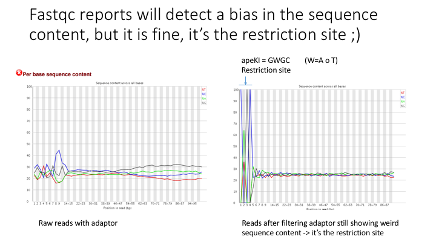

Está bien, pues  lo esperado para este tipo de datos aunque Fastqc brinque ;)

### Reporta pasos bioinformáticos en métodos y resultados

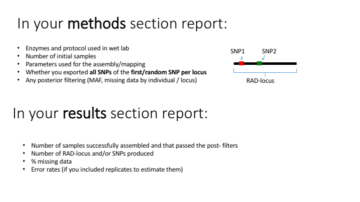

## Nota feliz sobre parálogos

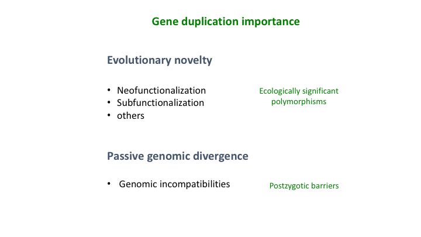

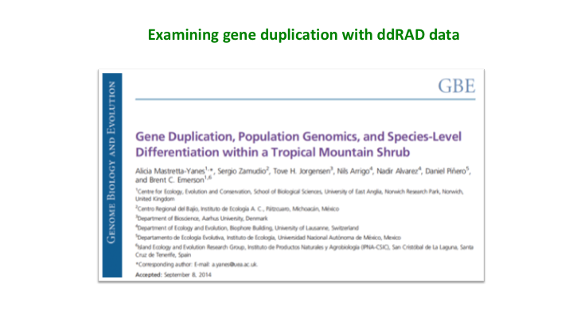

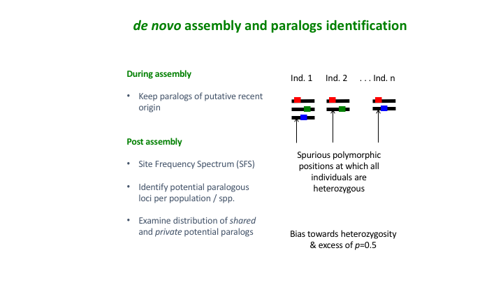

