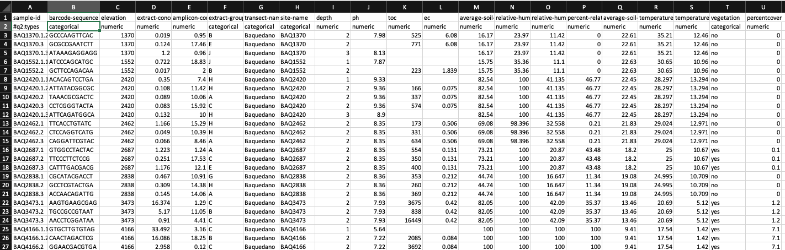
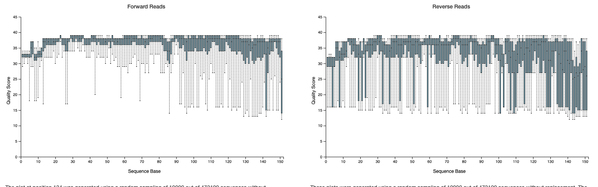

## Hola a tod@s!

En esta clase utilizaremos el programa gratuito QIIME 2 para analizar y visualizar análisis de diversidad de muestras microbiológicas (arqueas, bacterias y hongos) usando sequencias de ADN en formato fastq.

QIIME es un programa que está en constante actualización, así que podrían ocurrir modificaciones en los comandos aquí presentados, por lo queden estar atentos a las nuevas actualizacione y reportes de bichos (bugs!).
Más información de QIIME en su [website](https://qiime2.org/).

---

## ¿Qué es QIIME 2?
QIIME 2 es una pipeline análisis de diversidad microbiológica. QIIME 2 permite analizar secuencias "single-end" y "paired-end", asociarlas a muestras específicas, realizan control de calidad y filtrado de las secuencias, asignar taxonomía a las secuencias, obtener datos de abundancia de cada una de las secuencias y taxones asignados en cada una de las muestras analizadas (matriz de abundancia), generar árboles filogenéticos, y analizar diversidades alfa y beta.

## ¿Qué es lo que necesitamos para usar QIIME 2?

1. **Instalar el programa**
Existen diferentes formas de instalar QIIME2 dependiendo si lo van a instalar de forma nativa o usando máquinas virtuales. Las instrucciones las pueden encontrar [aquí](https://docs.qiime2.org/2021.4/install/)

2. **Un archivo metadata**
	* Este es un archivo tab-limitado que contiene toda las información de la secuenciación y las muestras. Puedes crear este archivo en excel, pero debes guardarlo como una version de texto. Aquí abajo puder ver el archivo de metadatos (normalmente nombrado como "mapping file").
	
	

3. ** Archivo R1.fastq 
	* Este archivo contiene las lecturas "forward" entregadas por el secuenciador.
	
4. ** Archivo R2.fastq 
	* Este archivo contiene las lecturas "forward" entregadas por el secuenciador.	


## Manos a la obra!

1. Conectarse al servidor

`ssh -Y bioinfo1@genoma.med.uchile.cl`

2. Activar las versión 2019.4 de QIIME que está instalada en el servidor. La última versión disponible es la 2021.4

`source activate qiime2-2019.4`

3. Vayan a su carpeta de personal y creen una carpeta para el práctico e ir a ella.
Llamaremos a la carpeta "qiime2-atacama-soil" porque analizaremos la microbiota asociada a muestras de suelo obtenidas en el Desierto de Atacama.

`mkdir qiime2-atacama-soil`

`cd qiime2-atacama-soil`

## Descarga de datos

1. Descargaremos el archivo que contiene la [metadata](https://docs.google.com/spreadsheets/d/1LY3_jcLu0NeA-4jiP-7iuQQ7NCa9blAZHMgck_hyOEk/edit?usp=sharing), pero antes le daremos una mirada para ver cómo está estructurado.

2. Ahora si lo descargamos directo en nuestra carpeta.

```
wget \
  -O "sample-metadata.tsv" \
  "https://data.qiime2.org/2021.4/tutorials/atacama-soils/sample_metadata.tsv"
```


3. Ahora vamos a descargar las secuencias: forward = R1, reverse = R2, y los códigos de barras (barcodes), pero antes crearemos una carpeta y descargaremos las secuencias en ella.

`mkdir emp-paired-end-sequences`

Descargamos las secuencias R1.

```
wget \
  -O "emp-paired-end-sequences/forward.fastq.gz" \
  "https://data.qiime2.org/2021.4/tutorials/atacama-soils/10p/forward.fastq.gz"
```

Descargamos las secuencias R2.

```
wget \
  -O "emp-paired-end-sequences/reverse.fastq.gz" \
  "https://data.qiime2.org/2021.4/tutorials/atacama-soils/10p/reverse.fastq.gz"
```

Descargamos las secuencias de códigos de barras.

```
wget \
  -O "emp-paired-end-sequences/barcodes.fastq.gz" \
  "https://data.qiime2.org/2021.4/tutorials/atacama-soils/10p/barcodes.fastq.gz"
```

## Comandos de análisis

1. QIIME 2 crea estos artefactos, los cuales contienen información acerca del tipo y procedencia de los datos. Así que lo primero que debemos hacer es crear un artefacto para analizar las secuencias. 
El tipo de artefacto que vamos a crear es EMPairedEndSequence si tenemos lecturas R1 y R2. Este tipo de artefacto contiene secuencias que están multiplexadas, es decir, que las secuencias no han sido asignadas a cada una de las muestras. El proceso de asignar las secuencias a las respectivas muestras se llama demultiplexar y para esto requerimos un archivo con las secuencias de los códigos de barras, los cuales son únicos para cada muestra.
Para este ejemplo en específico vamos a trabajar con secuencias EMPairedEndSequence, que quiere decir que están formateadas según el Earth Microbiome Project (EMP). Para ver cómo se pueden importar otros tipos de secuencias, revisa el [tutorial para importar data](https://docs.qiime2.org/2021.4/tutorials/importing/).

```
qiime tools import \
  --type EMPPairedEndSequences \
  --input-path emp-paired-end-sequences \
  --output-path emp-paired-end-sequences.qza
```

Artefactos resultantes:

`emp-paired-end-sequences.qza`  Secuencias paired-end para analizar


2. Ahora vamos a asignar las secuencias a cada una de las muestras, es decir, vamos a multiplexear. Para esto debemos indicar el archivo donde están contenidos los códigos de barras (en este ejemplo: barcodes.fastq.gz), el archivo con la metadata (en este ejemplo: sample_metadata.tsv) y la columna donde están indicados los códigos de barra (en este ejemplo: barcode_sequences).
Dentro de la secuencia, los códigos de barras son el inverso complementario respecto a los códigos de barras indicados en la metadata, así que debemos incluir el parámetro `--p-rev-comp-mapping-barcodes`.

```
qiime demux emp-paired \
  --m-barcodes-file sample-metadata.tsv \
  --m-barcodes-column barcode-sequence \
  --p-rev-comp-mapping-barcodes \
  --i-seqs emp-paired-end-sequences.qza \
  --o-per-sample-sequences demux-full.qza \
  --o-error-correction-details demux-details.qza
```

Artefactos resultantes:

`demux-full.qza`  Secuencias demultiplexadas

`demux-details.qza`  Detalles de la demultiplexación
             


3. Después de demultiplexar, vamos a generar una artefacto resumen. Esto permite visualizar cuántas secuencias hay para cada muestra y la calidad de la secuenciación en términos de valores de Q-phred.

```
qiime demux summarize \
  --i-data demux-full.qza \
  --o-visualization demux-full.qzv
```

Visualizaciones resultantes:

`demux-full.qzv`  Visualización de la demultiplexación


4. Dado que no podemos visualizar los resultados de este artefacto, descargaremos este archivo a nuestro computador y los visualizaremos en [QIIME2view](https://view.qiime2.org/). Abrimos una nueva ventana en el Terminal y descargamos el archivo `demux-full.qzv` dependiendo en dónde esté alojado y dónde queramos guardarlo.

`scp server:/source_route/file_source_name destiny_route/file_destiny_name`

Si están corriendo QIIME 2 en su computador, simplemente corran el siguiente comando:

`qiime tools view demux-full.qzv`

Como pueden observar hay varias muestras con menos de 110 lecturas, por lo que deberíamos eliminarlas de nuestro set de datos.


## Control de calidad de las secuencias y construcción de la tabla de características

QIIME 2 tiene varias alternativas para realizar este proceso. Por ejemplo: [DADA2](https://www.ncbi.nlm.nih.gov/pubmed/27214047), [Deblur](http://msystems.asm.org/content/2/2/e00191-16) y el [filtrado basado en puntaje de calidad](https://www.nature.com/nmeth/journal/v10/n1/abs/nmeth.2276.html). En este tutorial usaremos DADA2, él cual además está disponible para ser usado en R.

DADA2 es una "pipeline" que permite detectar y corregir secuencias de amplicones Illumina. DADA2 además permite filtrar lecturas asociadas a phiX y secuencias quimeras.

1. El comando de DADA2 requiere dos parámetros que serán usados en el filtrado de calidad: `--p-trim-left m`, el cual poda las primeras `m` bases de cada secuencia, y `--p-trunc-len n`, el cual corta cada secuencia en la posición `n`. Este paso permite remover regiones con baja calidad de las secuencias. Para determinar que valores tomar para estos dos parámetros, debemos revisar el *Interactive Quality Plot* del archivo `demux-full.qzv`. 



```
qiime dada2 denoise-paired \
  --i-demultiplexed-seqs demux-full.qza \
  --p-trim-left-f 13 \
  --p-trim-left-r 13 \
  --p-trunc-len-f 150 \
  --p-trunc-len-r 150 \
  --o-table table.qza \
  --o-representative-sequences rep-seqs.qza \
  --o-denoising-stats denoising-stats.qza
```

Artefactos resultantes:

`denoising-stats.qza`  Estadísticas del filtrado de calidad (denoising)
			  
`rep-seqs.qza`  Secuencias representativas
		      
`table.qza`  Información sobre las abundancias de cada secuencia  

2. Para visualizar estos artefactos, generaremos archivos visuales.

```
qiime metadata tabulate \
  --m-input-file denoising-stats.qza \
  --o-visualization denoising-stats.qzv

qiime feature-table summarize \
  --i-table table.qza \
  --o-visualization table.qzv \
  --m-sample-metadata-file sample-metadata.tsv

qiime feature-table tabulate-seqs \
  --i-data rep-seqs.qza \
  --o-visualization rep-seqs.qzv
```

Visualizaciones resultantes:

`denoising-stats.qzv`  Estadísticas del filtrado de calidad (denoising)

`table.qzv`  Información sobre las abundancias de cada secuencia

`rep-seqs.qzv`  Secuencias representativas


3. Descargamos estos archivos y los visualizaremos en [QIIME2view](https://view.qiime2.org/). 

`scp server:/source_route/file_source_name destiny_route/file_destiny_name`


## Análisis de microbiomas

Con los pasos anteriormente ejecutados hemos logrado secuencias filtradas por calidad y sus abundancias. Los siguientes pasos para obtener información sobre la diversidad taxonómica de las muestras serán ejecutado en [Tutorial QIIME 2 parte 2](Tutorial_QIIME2_pt2.md)

