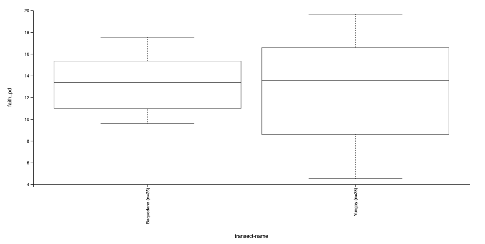
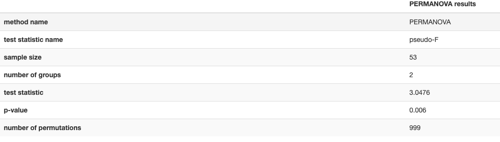
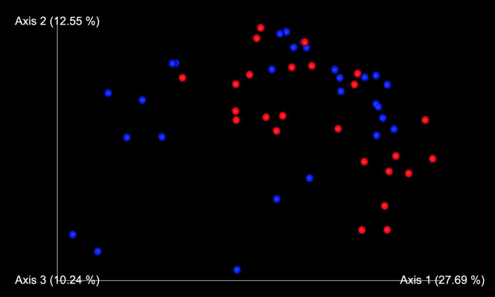
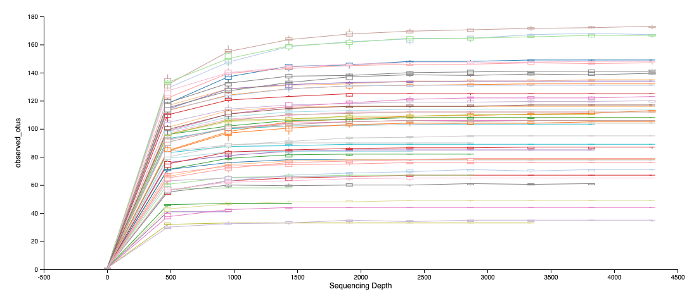

## Hola a tod@s!

En esta clase utilizaremos el programa gratuito QIIME 2 para analizar y visualizar análisis de diversidad de muestras microbiológicas (arqueas, bacterias y hongos) usando sequencias de ADN en formato fastq.

QIIME es un programa que está en constante actualización, así que podrían ocurrir modificaciones en los comandos aquí presentados, por lo queden estar atentos a las nuevas actualizacione y reportes de bichos (bugs!).
Más información de QIIME en su [website](https://qiime2.org/).

---

## Continuamos con QIIME2

## Generar un árbol para los análisis de diversidad filogenética

QIIME realiza varios análisis de diversidad genética, incluyendo la diversidad genética de Faith y las matrices UniFrac ponderadas y no-ponderadas.
Este árbol se construye alineando todas nuestras secuencias, removiendo las posiciones altamente variables. Luego, QIIME usa FastTree para generar un árbol filogenético.

```
qiime phylogeny align-to-tree-mafft-fasttree \
  --i-sequences rep-seqs.qza \
  --o-alignment aligned-rep-seqs.qza \
  --o-masked-alignment masked-aligned-rep-seqs.qza \
  --o-tree unrooted-tree.qza \
  --o-rooted-tree rooted-tree.qza
```

Artefactos resultantes:

```
aligned-rep-seqs.qza
masked-aligned-rep-seqs.qza
unrooted-tree.qza
rooted-tree.qza
```


## Diversidad alfa y beta

QIIME calcula las [métricas de diversidad alfa y beta](https://forum.qiime2.org/t/alpha-and-beta-diversity-explanations-and-commands/2282) de nuestras muestras, aplicando pruebas estadísticas asociadas y generando visualizaciones interactivas. Cómo elegir este valor no es fácil y debe estar basado en el número de secuencias que tiene cada muestra.

1. Ahora vamos a calcular las métricas de diversidad alfa y beta con el comando `core-metrics-phylogenetic`, él cual a demás generará un análisis de coordenadas principales (PCoA).

##### Recuerden que el valor asignado a `--p-sampling-depth` va a depender caso a caso, y en nuestro caso elegiremos retener 900 secuencias (muestras son menos de 900 secuencias serán eliminadas para los siguientes pasos).
```
qiime diversity core-metrics-phylogenetic \
  --i-phylogeny rooted-tree.qza \
  --i-table table.qza \
  --p-sampling-depth 900 \
  --m-metadata-file sample-metadata.tsv \
  --output-dir core-metrics-results
```

Artefactos resultantes

```
core-metrics-results/faith_pd_vector.qza

core-metrics-results/unweighted_unifrac_distance_matrix.qza

core-metrics-results/bray_curtis_pcoa_results.qza

core-metrics-results/shannon_vector.qza:

core-metrics-results/rarefied_table.qza

core-metrics-results/weighted_unifrac_distance_matrix.qza

core-metrics-results/jaccard_pcoa_results.qza

core-metrics-results/weighted_unifrac_pcoa_results.qza

core-metrics-results/observed_features_vector.qza

core-metrics-results/jaccard_distance_matrix.qza

core-metrics-results/evenness_vector.qza

core-metrics-results/bray_curtis_distance_matrix.qza

core-metrics-results/unweighted_unifrac_pcoa_results.qza
```

Visualizaciones resultantes:

```
core-metrics-results/unweighted_unifrac_emperor.qzv

core-metrics-results/jaccard_emperor.qzv

core-metrics-results/bray_curtis_emperor.qzv

core-metrics-results/weighted_unifrac_emperor.qzv
```

2. Con esta información ya podemos explorar la diversidad microbiológica en nuestras muestras y compararlas entre sí. Qué vamos a comparar va a depender de nuestros metadata y qué métrica de diversidad vamos a analizar.


Para este ejemplo vamos a analizar de la diversidad filogenética de Faith (una medida de la riqueza de la comunidad, pero tomando en cuenta las relaciones filogenéticas entre las secuencias).

```
qiime diversity alpha-group-significance \--i-alpha-diversity core-metrics-results/faith_pd_vector.qza \
  --m-metadata-file sample-metadata.tsv \
  --o-visualization core-metrics-results/faith-pd-group-significance.qzv
  
```

Visualizaciones resultantes:

`core-metrics-results/faith-pd-group-significance.qzv`   Diversidad filogenética de Faith



3. Ahora vamos a analizar la estructura comunitaria a través de un análisis llamado PERMANOVA ([Anderson 2001](https://onlinelibrary.wiley.com/doi/full/10.1111/j.1442-9993.2001.01070.pp.x)), el cual usa la matriz de distancia entre cada una de las muestras para estimar la diferencias entre grupos.

```
qiime diversity beta-group-significance \
  --i-distance-matrix core-metrics-results/weighted_unifrac_distance_matrix.qza \
  --m-metadata-file sample-metadata.tsv \
  --m-metadata-column transect-name \
  --o-visualization core-metrics-results/weighted-unifrac-transect-name-significance.qzv
```

Visualizaciones resultantes:

`core-metrics-results/unweighted-unifrac-transect-name-significance.qzv`		Resultado del PERMANOVA



4. Ahora vamos a gráficas las distancias entre muestras a través de un análisis de coordenadas principales (PCoA) usando [EMPeror](https://www.ncbi.nlm.nih.gov/pmc/articles/PMC4076506/).

```
qiime emperor plot \
  --i-pcoa core-metrics-results/weighted_unifrac_pcoa_results.qza \
  --m-metadata-file sample-metadata.tsv \
  --o-visualization core-metrics-results/weighted-unifrac-emperor.qzv
```

Visualizaciones resultantes:

`core-metrics-results/weighted-unifrac-emperor.qzv`		Resultado del PCoA



5. Rarefacción alfa

Para saber la eficacia de nuestra secuenciación en términos de rescatar la diversidad de la comunidad microbiológica, necesitamos explorar la diversidad alfa en función de la profundidad de secuenciación.

```
qiime diversity alpha-rarefaction \
  --i-table table.qza \
  --i-phylogeny rooted-tree.qza \
  --p-max-depth 4300 \
  --m-metadata-file sample-metadata.tsv \
  --o-visualization alpha-rarefaction.qzv
```

Visualizaciones resultantes:

`alpha-rarefaction.qzv`		Gráfico de rarefacción



